# AI SDK Dart

A Dart/Flutter port of [Vercel AI SDK v6](https://sdk.vercel.ai), providing provider-agnostic APIs for text generation, streaming, structured output, tool use, embeddings, and more.

---

## What to install

This is a **monorepo** — published as separate packages on pub.dev. You always need **two** packages: the core `ai` package plus one provider.

### For a Dart app

```sh
# Pick your provider:
dart pub add ai ai_sdk_openai     # OpenAI / Azure OpenAI / compatible
dart pub add ai ai_sdk_anthropic  # Anthropic (Claude)
dart pub add ai ai_sdk_google     # Google Generative AI (Gemini)
```

### For a Flutter app (adds UI controllers)

```sh
dart pub add ai ai_sdk_openai ai_sdk_flutter
```

### For MCP tool servers

```sh
dart pub add ai ai_sdk_mcp
```

> `ai_sdk_provider` is a transitive dependency — you **do not** need to add it directly.

---

## Package overview

| Package | Install | What it gives you |
|---------|---------|-------------------|
| [`ai`](https://pub.dev/packages/ai) | always | `generateText`, `streamText`, tools, middleware, embeddings |
| [`ai_sdk_openai`](https://pub.dev/packages/ai_sdk_openai) | + OpenAI | `openai('gpt-4.1-mini')`, embeddings, image gen |
| [`ai_sdk_anthropic`](https://pub.dev/packages/ai_sdk_anthropic) | + Anthropic | `anthropic('claude-sonnet-4-5')` |
| [`ai_sdk_google`](https://pub.dev/packages/ai_sdk_google) | + Google | `google('gemini-2.0-flash')`, embeddings |
| [`ai_sdk_flutter`](https://pub.dev/packages/ai_sdk_flutter) | + Flutter UI | `ChatController`, `CompletionController`, `ObjectStreamController` |
| [`ai_sdk_mcp`](https://pub.dev/packages/ai_sdk_mcp) | + MCP | `MCPClient`, `SseClientTransport`, `StdioMCPTransport` |
| [`ai_sdk_provider`](https://pub.dev/packages/ai_sdk_provider) | (auto) | Provider interfaces for building custom providers |

---

## Quick start

```sh
dart pub add ai ai_sdk_openai
export OPENAI_API_KEY=sk-...
```

```dart
import 'package:ai/ai.dart';
import 'package:ai_sdk_openai/ai_sdk_openai.dart';

void main() async {
  // Text generation
  final result = await generateText(
    model: openai('gpt-4.1-mini'),
    prompt: 'Say hello from AI SDK Dart!',
  );
  print(result.text);
}
```

### Streaming

```dart
final result = await streamText(
  model: openai('gpt-4.1-mini'),
  prompt: 'Count from 1 to 5.',
);
await for (final chunk in result.textStream) {
  stdout.write(chunk);
}
```

### Structured output

```dart
final result = await generateText<Map<String, dynamic>>(
  model: openai('gpt-4.1-mini'),
  prompt: 'Return the capital and currency of Japan as JSON.',
  output: Output.object(
    schema: Schema<Map<String, dynamic>>(
      jsonSchema: const {'type': 'object', 'properties': {
        'capital': {'type': 'string'},
        'currency': {'type': 'string'},
      }},
      fromJson: (json) => json,
    ),
  ),
);
print(result.output); // {capital: Tokyo, currency: JPY}
```

### Type-safe tools

```dart
final result = await generateText(
  model: openai('gpt-4.1-mini'),
  prompt: 'What is the weather in Paris?',
  maxSteps: 5,
  tools: {
    'getWeather': tool<Map<String, dynamic>, String>(
      description: 'Get current weather for a city.',
      inputSchema: Schema(
        jsonSchema: const {'type': 'object', 'properties': {
          'city': {'type': 'string'},
        }},
        fromJson: (json) => json,
      ),
      execute: (input, _) async => 'Sunny, 18°C',
    ),
  },
);
print(result.text);
```

### Middleware

```dart
final model = wrapLanguageModel(
  openai('gpt-4.1-mini'),
  [
    defaultSettingsMiddleware(temperature: 0.7),
    extractReasoningMiddleware(tagName: 'think'),
  ],
);
```

### Flutter chat UI

```dart
import 'package:ai_sdk_flutter/ai_sdk_flutter.dart';

final chat = ChatController(model: openai('gpt-4.1-mini'));

// In your widget:
await chat.append('Tell me a joke');
print(chat.messages.last.content);
```

---

## v6 Parity

See [docs/v6-parity-matrix.md](docs/v6-parity-matrix.md) for a feature-by-feature parity matrix against Vercel AI SDK v6.

---

## Runnable examples

Set API keys before running (or use `--dart-define`):

```sh
export OPENAI_API_KEY=sk-...
export ANTHROPIC_API_KEY=sk-ant-...   # for advanced app
export GOOGLE_API_KEY=AIza...         # for advanced app
```

### 1. Dart CLI (`examples/basic`)

Demonstrates: `generateText`, `streamText`, structured output, tools, embeddings, middleware, and the provider registry.

```sh
make run-basic
# or manually:
cd examples/basic && dart run lib/main.dart
```

### 2. Flutter chat app (`examples/flutter_chat`)

The Flutter example showcases all three `ai_sdk_flutter` controllers with a Material 3 UI: **Chat** (multi-turn streaming), **Completion** (single-turn with presets), and **Object** (streaming structured JSON).

| Chat | Completion | Object stream |
|------|------------|---------------|
| [ChatController](examples/flutter_chat/lib/pages/chat_page.dart) — multi-turn streaming chat | [CompletionController](examples/flutter_chat/lib/pages/completion_page.dart) — single-turn with preset prompts | [ObjectStreamController](examples/flutter_chat/lib/pages/object_stream_page.dart) — typed JSON stream |

**Chat flow** — home, streaming response, full response, multi-turn

| Home | Streaming | Response | Long response | Multi-turn |
|------|-----------|----------|---------------|------------|
|  |  | 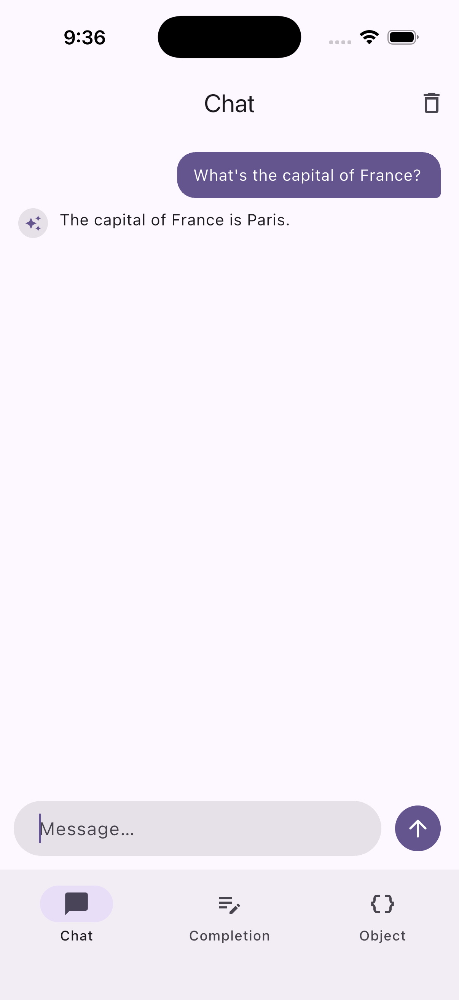 |  | 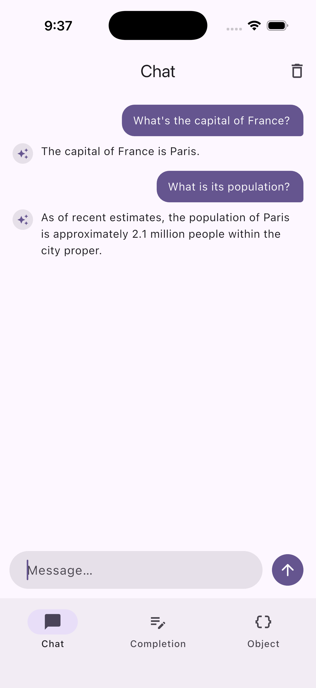 |

**Completion** — presets and generated results

| Home | Async/await | Haiku | Tips |
|------|-------------|-------|------|
|  |  | 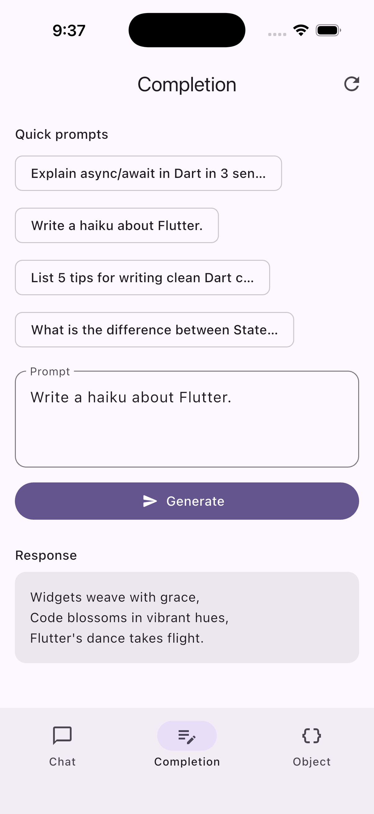 |  |

**Object stream** — country profile (typed JSON)

| Home | Japan | France |
|------|-------|--------|
|  | 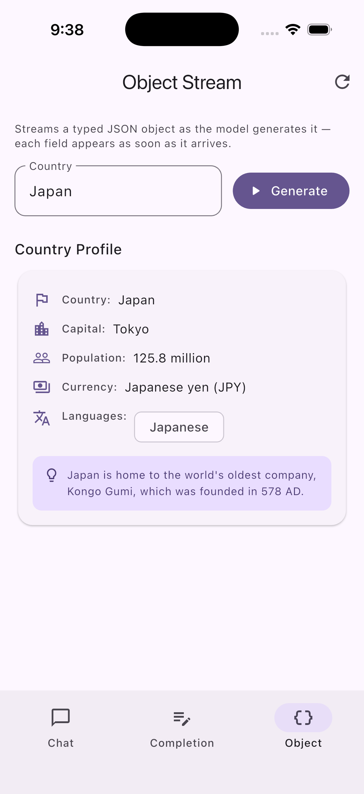 |  |

```sh
make run              # default device
make run-web          # Chrome
# or manually:
cd examples/flutter_chat && fvm flutter run --dart-define=OPENAI_API_KEY=sk-...
```

See [examples/flutter_chat/README.md](examples/flutter_chat/README.md) for structure and patterns.

### 3. Advanced app (`examples/advanced_app`)

Comprehensive demo of all AI SDK features: **Provider switcher** (OpenAI, Anthropic, Google), **Tools** (weather, calculator), **Image generation** (DALL-E 3), **Multimodal** (image + text), **Embeddings** (similarity), **Text-to-speech**, **Speech-to-text**, plus Chat, Completion, and Object stream.

```sh
make run-advanced       # default device
make run-advanced-web   # Chrome
# or manually:
cd examples/advanced_app && fvm flutter run --dart-define=OPENAI_API_KEY=sk-...
```

See [examples/advanced_app/README.md](examples/advanced_app/README.md) for features and API keys.

**Advanced app screenshots**

| Provider Chat | Tools Chat | Image Gen | Multimodal | Embeddings |
|---------------|------------|-----------|------------|------------|
| 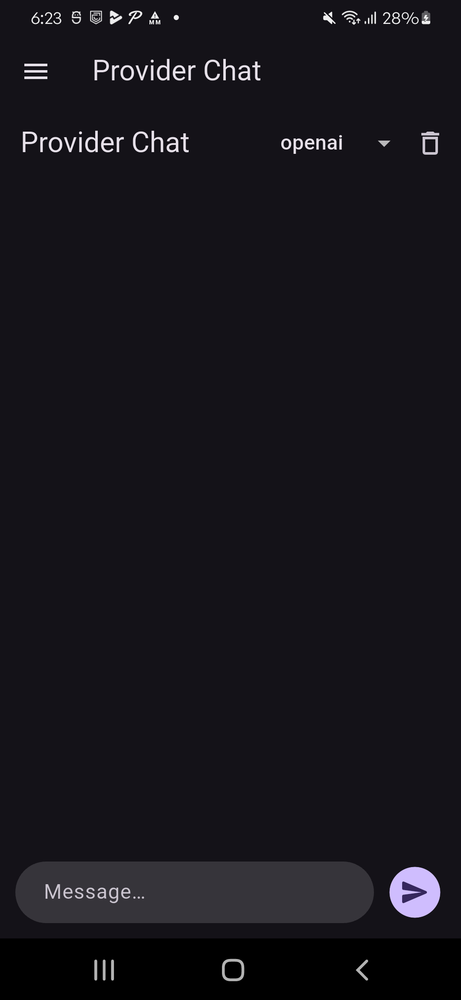 | 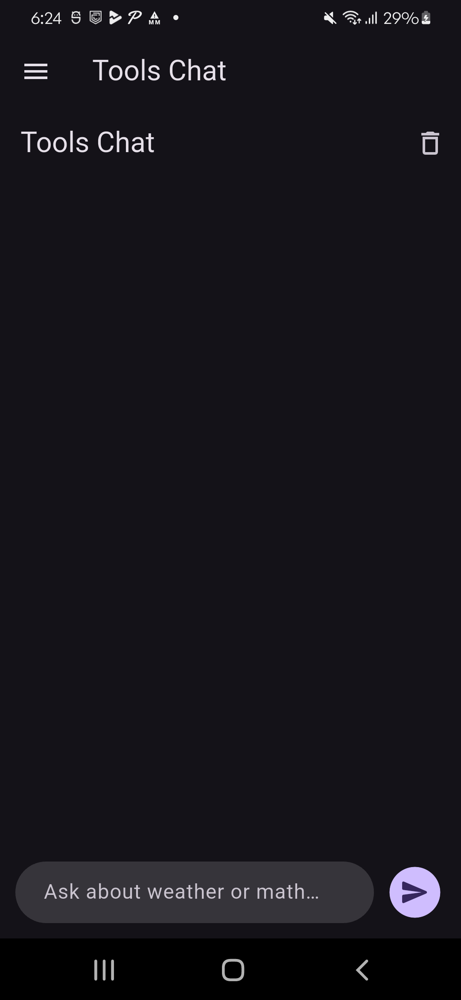 | 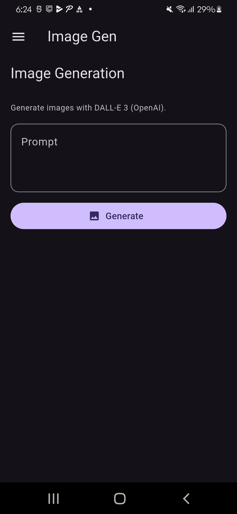 | 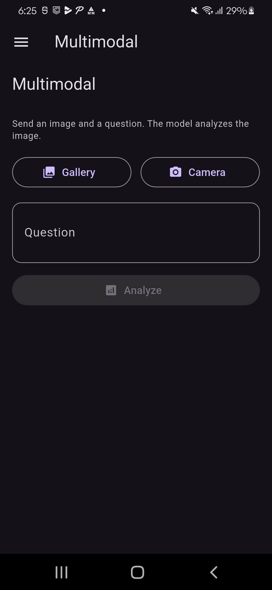 | 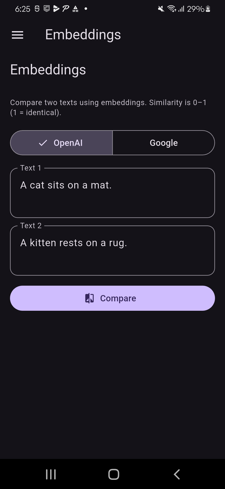 |

| Text-to-Speech | Speech-to-Text | Completion | Object Stream |
|----------------|----------------|------------|---------------|
| 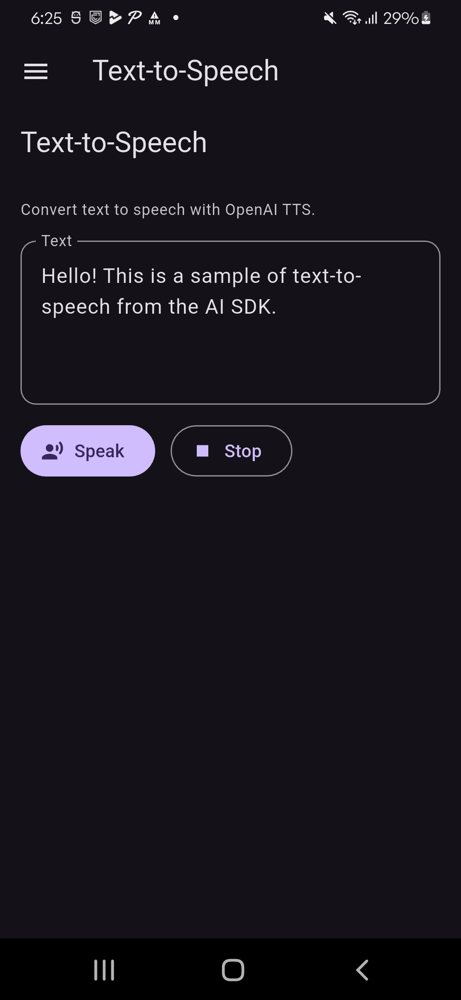 | 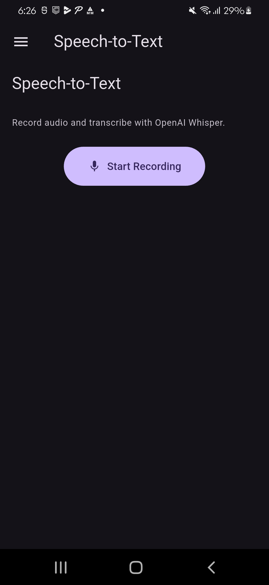 | 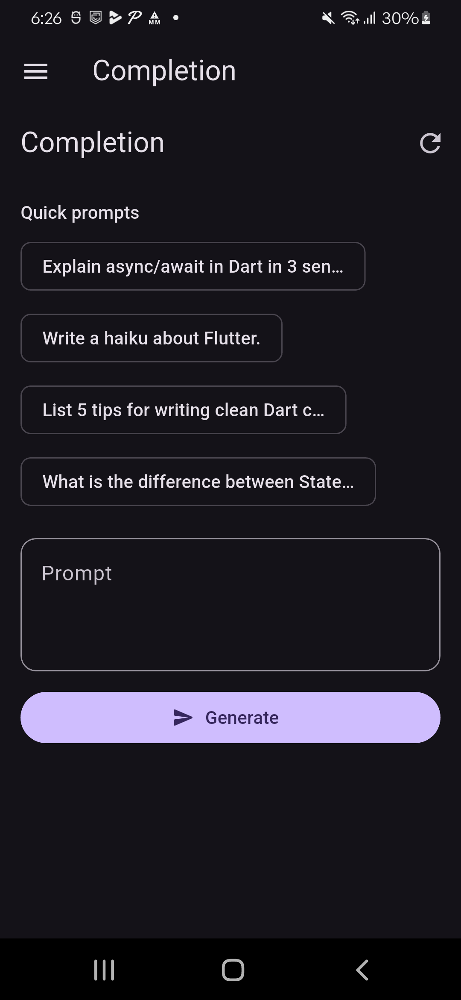 | 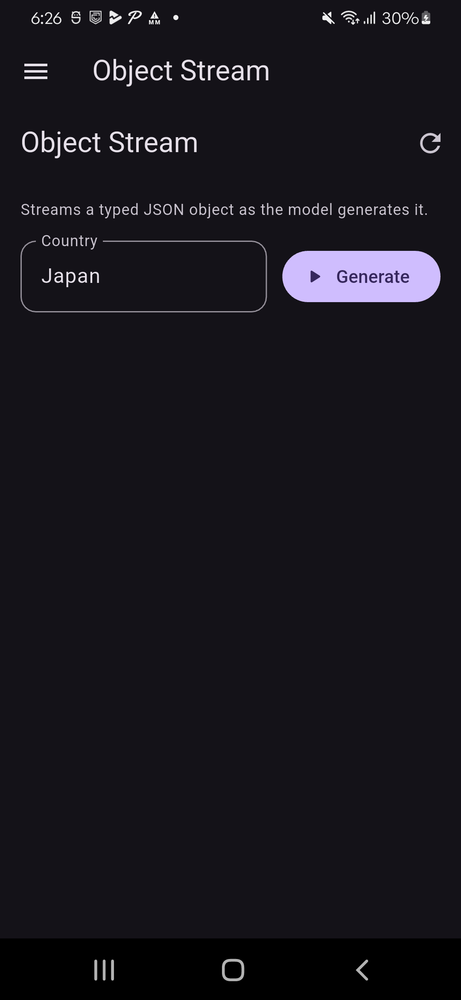 |

### Makefile summary

| Command | Description |
|---------|-------------|
| `make get` | Install all workspace dependencies |
| `make run` | Run Flutter chat app on default device |
| `make run-web` | Run Flutter chat app on Chrome |
| `make run-advanced` | Run advanced app on default device |
| `make run-advanced-web` | Run advanced app on Chrome |
| `make run-basic` | Run Dart CLI example |
| `make test` | Run all package tests |
| `make analyze` | Run dart analyze across all packages |
| `make format` | Format all Dart source files |

---

## Development

Managed with [Melos](https://melos.invertase.dev):

```sh
dart pub global activate melos
melos bootstrap    # install all dependencies
melos analyze      # run dart analyze across all packages
melos test         # run all tests
```

## License

MIT
