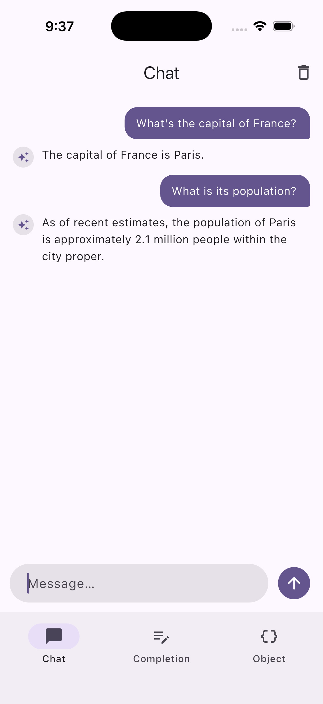
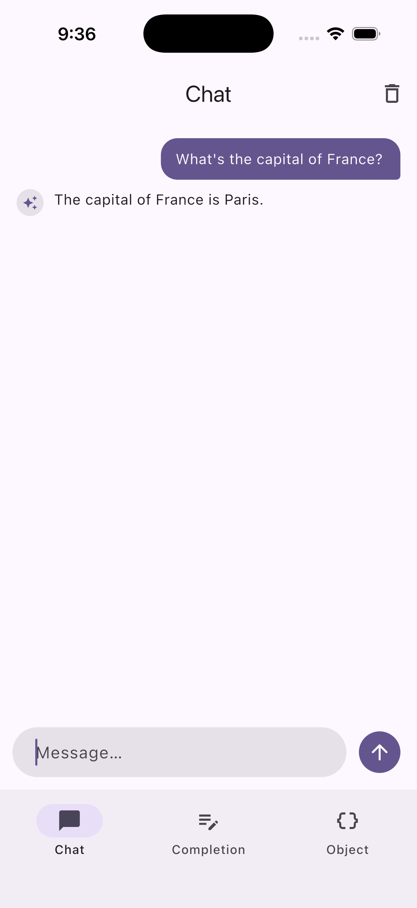
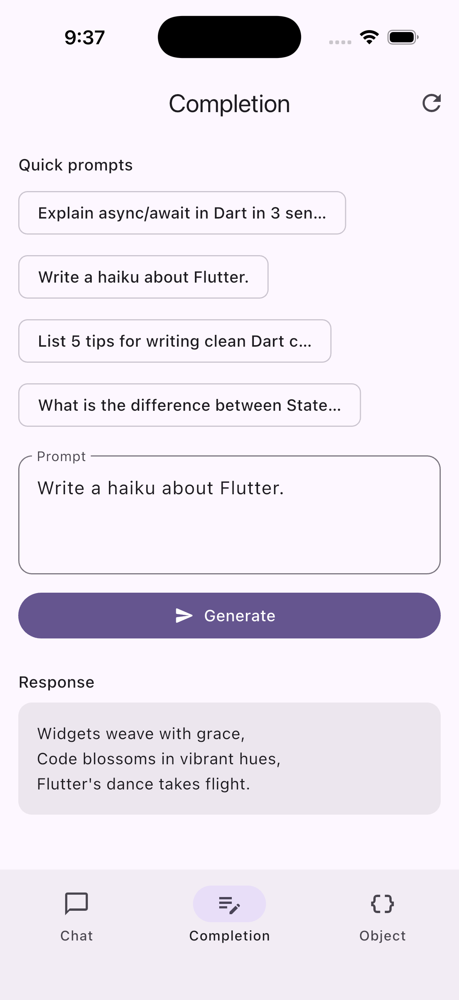
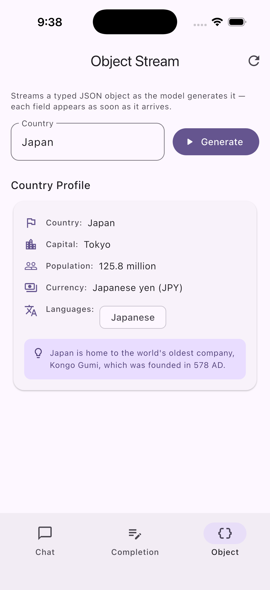
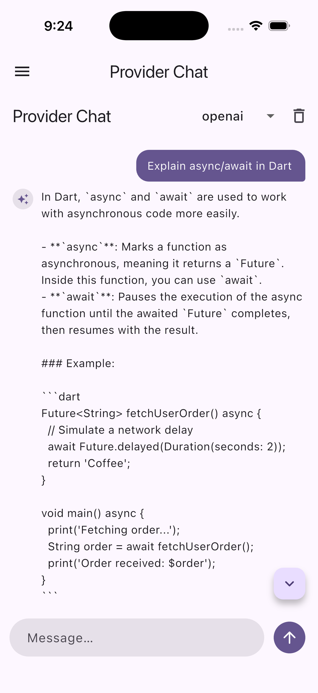
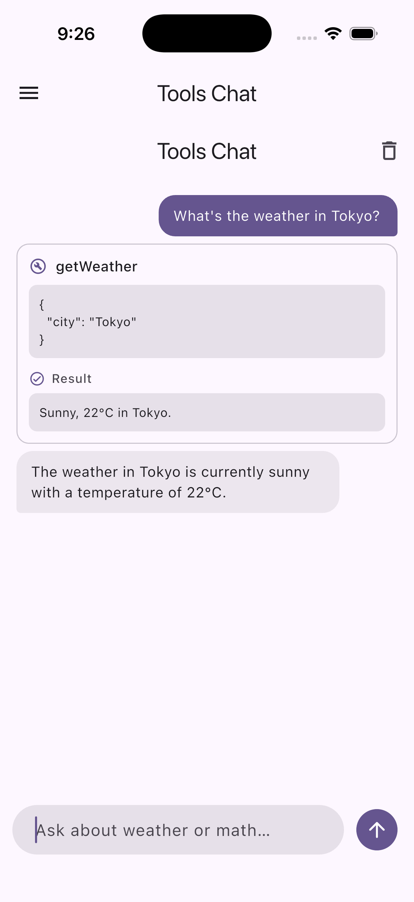
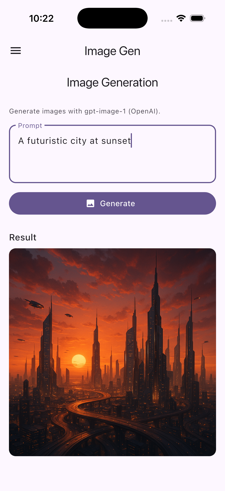
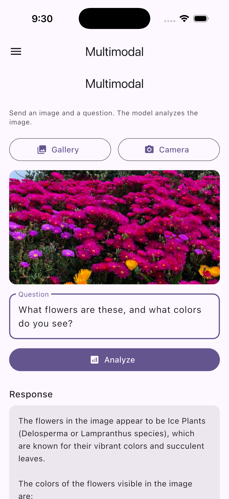

# 🤖 AI SDK Dart

**A Dart/Flutter port of [Vercel AI SDK v6](https://sdk.vercel.ai) — provider-agnostic APIs for text generation, streaming, structured output, tool use, embeddings, image generation, speech, and more.**

[](https://pub.dev/packages/ai_sdk_dart)
[](https://pub.dev/packages/ai_sdk_openai)
[](https://pub.dev/packages/ai_sdk_anthropic)
[](https://pub.dev/packages/ai_sdk_google)
[](https://pub.dev/packages/ai_sdk_azure)
[](https://pub.dev/packages/ai_sdk_cohere)
[](https://pub.dev/packages/ai_sdk_groq)
[](https://pub.dev/packages/ai_sdk_mistral)
[](https://pub.dev/packages/ai_sdk_ollama)
[](https://pub.dev/packages/ai_sdk_flutter_ui)
[](https://pub.dev/packages/ai_sdk_mcp)
[](https://pub.dev/packages/ai_sdk_provider)
[](https://github.com/codenameakshay/ai_sdk_dart/actions/workflows/ci.yml)
[](LICENSE)
[](https://dart.dev)

---

## What is this?

AI SDK Dart brings the core concepts of [Vercel AI SDK v6](https://sdk.vercel.ai) to Dart and Flutter. Write your AI logic once, swap providers without changing business code, and ship on mobile, web, and server. The API follows the same provider-agnostic model while using idiomatic Dart types and lifecycle primitives.

## Upgrading to 2.0

Version 2.0 replaces the language-model V3 provider seam with V4 and removes
the obsolete V3 types. Most apps can upgrade their coordinated `ai_sdk_*`
dependencies together; custom providers, middleware, and direct provider-type
consumers need source changes. See the [2.0 migration guide](https://github.com/codenameakshay/ai_sdk_dart/blob/main/docs/migration-2.0.md)
for the exact renames and contract changes.

---

## Screenshots

### Flutter Chat App (`examples/flutter_chat`)

<table>
  <tr>
    <td align="center"><b>Multi-turn Chat</b></td>
    <td align="center"><b>Streaming Response</b></td>
  </tr>
  <tr>
    <td></td>
    <td></td>
  </tr>
  <tr>
    <td align="center"><b>Completion</b></td>
    <td align="center"><b>Object Stream</b></td>
  </tr>
  <tr>
    <td></td>
    <td></td>
  </tr>
</table>

### Advanced App (`examples/advanced_app`)

<table>
  <tr>
    <td align="center"><b>Provider Chat</b></td>
    <td align="center"><b>Tools Chat</b></td>
  </tr>
  <tr>
    <td></td>
    <td></td>
  </tr>
  <tr>
    <td align="center"><b>Image Generation</b></td>
    <td align="center"><b>Multimodal</b></td>
  </tr>
  <tr>
    <td></td>
    <td></td>
  </tr>
</table>

---

## ✨ Features

### 🗣️ Text Generation & Streaming
- `generateText` — single-turn or multi-step text generation with full result envelope
- `streamText` — real-time token streaming with typed event taxonomy
- `smoothStream` transform — configurable chunk-size smoothing; `delayInMs` option adds per-chunk delay for UX pacing
- Multi-step agentic loops with `maxSteps`, `prepareStep`, and `stopConditions`
- `timeout` parameter on all core functions — apply `Duration` deadlines to any model call
- Callbacks: `onFinish`, `onStepFinish`, `onChunk`, `onError`, `experimentalOnStart`, `onAbort`

### 🧩 Structured Output
- `Output.object(schema)` — parse model output into a typed Dart object
- `Output.array(schema)` — parse model output into a typed Dart list
- `Output.choice(options)` — constrain output to a fixed set of string values
- `Output.json()` — raw JSON without schema validation
- Automatic code-fence stripping (` ```json ... ``` `)

### 🔧 Type-Safe Tools & Multi-Step Agents
- `tool<Input, Output>()` — fully typed tool definitions with JSON schema
- `dynamicTool()` — tools with unknown input type for dynamic use cases
- Tool choice: `auto`, `required`, `none`, or specific tool
- Tool approval workflow with `needsApproval`
- Multi-step agentic loops with automatic tool result injection
- `onInputStart`, `onInputDelta`, `onInputAvailable` lifecycle hooks

### 🖼️ Multimodal
- `generateImage` — image generation (gpt-image-1 / DALL·E via OpenAI)
- `generateSpeech` — text-to-speech audio synthesis
- `transcribe` — speech-to-text transcription
- Image inputs in prompts (multimodal vision)

### 🧮 Embeddings & Cosine Similarity
- `embed()` — single value embedding with usage tracking
- `embedMany()` — batch embedding for multiple values with configurable chunk size
- `cosineSimilarity()` — built-in similarity computation
- `wrapEmbeddingModel()` — composable middleware pipeline for embedding models

### 🧱 Middleware System
- `wrapLanguageModel(model: ..., middleware: ...)` — composable middleware pipeline
- `extractReasoningMiddleware` — strips `<think>` tags into `ReasoningPart`
- `extractJsonMiddleware` — strips ` ```json ``` ` fences
- `simulateStreamingMiddleware` — converts non-streaming models to streaming
- `defaultSettingsMiddleware` — applies default temperature/top-p/etc.
- `addToolInputExamplesMiddleware` — enriches tool descriptions with examples
- `wrapEmbeddingModel` / `wrapImageModel` — the same composable middleware pattern for embedding and image models

### 🌐 Provider Registry
- `createProviderRegistry` — map provider aliases to model factories
- `customProvider()` — lightweight on-the-fly provider construction without a full registry
- Resolve models by `'provider:modelId'` string at runtime
- Supports 6 model categories: language, embedding, image, speech, transcription, rerank
- Mix providers in a single registry for multi-provider apps

### 📱 Flutter UI Controllers & Widgets
- `ChatController` — multi-turn streaming chat with message history
- `CompletionController` — single-turn text completion with status
- `ObjectStreamController` — streaming typed JSON object updates
- **19 prebuilt, themeable Material widgets** — `AiChatScaffold`, message list/bubbles, composer,
  streaming text, typing indicator, tool-call & approval cards, reasoning, citations, usage, and more

### 🔌 MCP Client (Model Context Protocol)
- `MCPClient` — connect to MCP servers, discover tools, invoke them
- `StreamableHttpClientTransport` — MCP Streamable HTTP transport (`2025-06-18`) for remote servers
- `StdioMCPTransport` — stdio process transport (native platforms)
- **Web-safe** — `dart:io` is isolated behind conditional imports, so the client runs on Flutter web
- Discovered tools are directly compatible with `generateText`/`streamText`

### 🚨 Typed Errors
- Sealed `AiSdkError` hierarchy — `AiApiCallError`, `AiNoObjectGeneratedError`, and `AiRetryError` for exhausted retryable failures
- **Provider API errors are typed** — a non-2xx response throws `AiApiCallError` carrying the
  provider's `message`, `type`, `code`, `statusCode`, raw body, and an `isRetryable` flag,
  consistently across every provider

### 🧪 Conformance Suite
- Comprehensive Dart and Flutter tests across every package and both example apps
- A **99% line-coverage gate** for published package libraries enforced in CI
- Provider wire-format conformance tests for every provider (plus a typed-error conformance test per provider)
- `MockEmbeddingModelV3` testing utility for embedding model conformance

---

## 📦 Packages

| Package | pub.dev | What it gives you |
|---------|---------|-------------------|
| [`ai_sdk_dart`](https://pub.dev/packages/ai_sdk_dart) | `dart pub add ai_sdk_dart` | `generateText`, `streamText`, tools, middleware, embeddings, registry |
| [`ai_sdk_openai`](https://pub.dev/packages/ai_sdk_openai) | `dart pub add ai_sdk_openai` | `openai('gpt-4.1-mini')`, embeddings, image gen, speech, transcription, reasoning options |
| [`ai_sdk_anthropic`](https://pub.dev/packages/ai_sdk_anthropic) | `dart pub add ai_sdk_anthropic` | `anthropic('claude-sonnet-4-5')`, extended thinking, speed options |
| [`ai_sdk_google`](https://pub.dev/packages/ai_sdk_google) | `dart pub add ai_sdk_google` | `google('gemini-2.0-flash')`, embeddings |
| [`ai_sdk_azure`](https://pub.dev/packages/ai_sdk_azure) | `dart pub add ai_sdk_azure` | `AzureOpenAIProvider(endpoint, apiKey)`, language models, embeddings |
| [`ai_sdk_cohere`](https://pub.dev/packages/ai_sdk_cohere) | `dart pub add ai_sdk_cohere` | `cohere('command-r-plus')`, embeddings, reranking |
| [`ai_sdk_groq`](https://pub.dev/packages/ai_sdk_groq) | `dart pub add ai_sdk_groq` | `groq('llama3-8b-8192')`, ultra-low latency inference |
| [`ai_sdk_mistral`](https://pub.dev/packages/ai_sdk_mistral) | `dart pub add ai_sdk_mistral` | `mistral('mistral-large-latest')`, embeddings |
| [`ai_sdk_ollama`](https://pub.dev/packages/ai_sdk_ollama) | `dart pub add ai_sdk_ollama` | `ollama('llama3')`, local inference, embeddings |
| [`ai_sdk_flutter_ui`](https://pub.dev/packages/ai_sdk_flutter_ui) | `dart pub add ai_sdk_flutter_ui` | `ChatController`, `CompletionController`, `ObjectStreamController` + 19 prebuilt chat widgets |
| [`ai_sdk_mcp`](https://pub.dev/packages/ai_sdk_mcp) | `dart pub add ai_sdk_mcp` | `MCPClient`, `StreamableHttpClientTransport`, native-only `StdioMCPTransport` |
| [`ai_sdk_provider`](https://pub.dev/packages/ai_sdk_provider) | *(transitive)* | Provider interfaces for building custom providers |
| `ai_sdk_openai_compatible` | *(transitive)* | Shared OpenAI Chat Completions base — powers the OpenAI/Azure/Groq/Mistral language models |

> `ai_sdk_provider` and `ai_sdk_openai_compatible` are transitive dependencies — you **do not** need to add them directly.

---

## 🚀 Quick Start

### Dart CLI

```sh
dart pub add ai_sdk_dart ai_sdk_openai
```

```dart
import 'dart:io';

import 'package:ai_sdk_dart/ai_sdk_dart.dart';
import 'package:ai_sdk_openai/ai_sdk_openai.dart';

Future<void> main() async {
  final apiKey = Platform.environment['OPENAI_API_KEY'];
  if (apiKey == null || apiKey.isEmpty) {
    throw StateError('Set OPENAI_API_KEY before running this example.');
  }

  final provider = OpenAIProvider(apiKey: apiKey);
  final result = await generateText(
    model: provider('gpt-4.1-mini'),
    prompt: 'Say hello from AI SDK Dart!',
  );
  print(result.text);
}
```

For server and CLI apps, prefer reading credentials from your runtime
environment and passing `apiKey:` yourself, as shown above. The convenience
factories like `openai('...')`, `anthropic('...')`, and `google('...')` read
compile-time defines such as `OPENAI_API_KEY`, so they are best paired with
`dart run --define=...` or Flutter `--dart-define=...`.

### Streaming

```dart
import 'dart:io';

final result = await streamText(
  model: openai('gpt-4.1-mini'),
  prompt: 'Count from 1 to 5.',
);
await for (final chunk in result.textStream) {
  stdout.write(chunk);
}
```

### Structured Output

```dart
final result = await generateText<Map<String, dynamic>>(
  model: openai('gpt-4.1-mini'),
  prompt: 'Return the capital and currency of Japan as JSON.',
  output: Output.object(
    schema: Schema<Map<String, dynamic>>(
      jsonSchema: const {
        'type': 'object',
        'properties': {
          'capital': {'type': 'string'},
          'currency': {'type': 'string'},
        },
      },
      fromJson: (json) => json,
    ),
  ),
);
print(result.output); // {capital: Tokyo, currency: JPY}
```

### Type-Safe Tools

```dart
final result = await generateText(
  model: openai('gpt-4.1-mini'),
  prompt: 'What is the weather in Paris?',
  maxSteps: 5,
  tools: {
    'getWeather': tool<Map<String, dynamic>, String>(
      description: 'Get current weather for a city.',
      inputSchema: Schema(
        jsonSchema: const {
          'type': 'object',
          'properties': {'city': {'type': 'string'}},
        },
        fromJson: (json) => json,
      ),
      execute: (input, _) async => 'Sunny, 18°C',
    ),
  },
);
print(result.text);
```

### Error handling

```dart
try {
  final result = await generateText(
    model: openai('gpt-4.1-mini'),
    prompt: 'Hello',
  );
} on AiApiCallError catch (e) {
  // Typed provider error — message, status, and retryability are all available.
  print('${e.statusCode}: ${e.message} (retryable: ${e.isRetryable})');
}
```

### Flutter Chat UI

```sh
dart pub add ai_sdk_dart ai_sdk_openai ai_sdk_flutter_ui
```

```dart
import 'package:ai_sdk_dart/ai_sdk_dart.dart';
import 'package:ai_sdk_openai/ai_sdk_openai.dart';
import 'package:ai_sdk_flutter_ui/ai_sdk_flutter_ui.dart';

final agent = ToolLoopAgent(
  model: openai('gpt-4.1-mini'),
  instructions: 'You are a helpful assistant.',
);
final chat = ChatController();

// In your widget — a complete chat surface:
AiChatScaffold(controller: chat, agent: agent);
```

> Do not ship long-lived provider API keys inside distributed browser, mobile,
> or desktop clients. Use a trusted proxy or backend-minted short-lived
> credentials instead. The Flutter examples below use `--dart-define` for local
> development and smoke testing, not as a production secret-distribution
> strategy.

---

## 🤖 Providers

| Capability | OpenAI | Anthropic | Google | Azure | Cohere | Groq | Mistral | Ollama |
|---|:---:|:---:|:---:|:---:|:---:|:---:|:---:|:---:|
| Text generation | ✅ | ✅ | ✅ | ✅ | ✅ | ✅ | ✅ | ✅ |
| Streaming | ✅ | ✅ | ✅ | ✅ | ✅ | ✅ | ✅ | ✅ |
| Structured output | ✅ | ✅ | ✅ | ✅ | ✅ | ✅ | ✅ | ✅ |
| Native JSON schema output | ✅ | — | — | ✅ | — | ✅ | ✅ | — |
| Tool use | ✅ | ✅ | ✅ | ✅ | ✅ | ✅ | ✅ | ✅ |
| Embeddings | ✅ | — | ✅ | ✅ | ✅ | — | ✅ | ✅ |
| Reranking | — | — | — | — | ✅ | — | — | — |
| Image generation | ✅ | — | — | — | — | — | — | — |
| Speech synthesis | ✅ | — | — | — | — | — | — | — |
| Transcription | ✅ | — | — | — | — | — | — | — |
| Extended thinking | — | ✅ | — | — | — | — | — | — |
| Reasoning options | ✅ | — | — | — | — | — | — | — |
| Multimodal (image input) | ✅ | ✅ | ✅ | ✅ | ✅ | ✅ | ✅ | ✅ |

---

## 🛠️ Flutter UI

The `ai_sdk_flutter_ui` package provides three reactive controllers plus a library of **19 prebuilt,
themeable Material widgets** — so you can wire up a full chat UI in a few lines, or drop down to the
controllers and render everything yourself.

### Drop-in chat UI

```dart
import 'package:ai_sdk_dart/ai_sdk_dart.dart';
import 'package:ai_sdk_flutter_ui/ai_sdk_flutter_ui.dart';

final agent = ToolLoopAgent(model: openai('gpt-4.1-mini'));
final chat = ChatController();

// A complete message list + composer, wired to the controller + agent:
AiChatScaffold(controller: chat, agent: agent);
```

Other widgets — `ChatMessageList`, `ChatMessageBubble`, `ChatComposer`, `StreamingTextView`,
`TypingIndicator`, `ToolCallCard`, `ToolApprovalCard`, `ReasoningView`, `SourceCitations`,
`UsageView`, `PromptSuggestions`, `ObjectStreamView`, and more — can be composed à la carte. They
read only the controllers' public state, so they work with any state-management approach.

### ChatController — Multi-turn streaming chat

```dart
final agent = ToolLoopAgent(model: openai('gpt-4.1-mini'));
final chat = ChatController();

// In your widget:
ListenableBuilder(
  listenable: chat,
  builder: (context, _) {
    return Column(
      children: [
        for (final msg in chat.messages)
          Text('${msg.role}: ${msg.content}'),
        if (chat.isLoading) const CircularProgressIndicator(),
      ],
    );
  },
);

// Send a message:
await chat.sendMessage(agent: agent, text: 'What is the capital of France?');
```

### CompletionController — Single-turn completion

```dart
final completion = CompletionController(
  agent: ToolLoopAgent(model: openai('gpt-4.1-mini')),
);
await completion.complete('Write a haiku about Dart.');
print(completion.completion);
```

### ObjectStreamController — Streaming typed JSON

```dart
final controller = ObjectStreamController<Map<String, dynamic>>(
  model: openai('gpt-4.1-mini'),
  schema: Schema<Map<String, dynamic>>(
    jsonSchema: const {'type': 'object'},
    fromJson: (json) => json,
  ),
);
await controller.submit('Describe Japan as a JSON object.');
print(controller.value); // Partial updates arrive in real-time
```

---

## 🔌 MCP Support

Connect to any [Model Context Protocol](https://modelcontextprotocol.io) server and use its tools directly in your AI calls:

```dart
import 'package:ai_sdk_dart/ai_sdk_dart.dart';
import 'package:ai_sdk_mcp/ai_sdk_mcp.dart';
import 'package:ai_sdk_openai/ai_sdk_openai.dart';

final client = MCPClient(
  transport: StreamableHttpClientTransport(
    url: Uri.parse('http://localhost:3000/mcp'),
    headers: {'Authorization': 'Bearer <short-lived-token>'},
  ),
);

await client.initialize();
final tools = await client.tools(); // Returns a ToolSet

final result = await generateText(
  model: openai('gpt-4.1-mini'),
  prompt: 'What files are in the project?',
  tools: tools,
  maxSteps: 5,
);
```

For stdio-based MCP servers (local processes):

```dart
final client = MCPClient(
  transport: StdioMCPTransport(
    command: 'npx',
    args: ['-y', '@modelcontextprotocol/server-filesystem', '/path/to/dir'],
  ),
);
```

`StreamableHttpClientTransport` speaks the MCP Streamable HTTP transport
(`2025-06-18`) against a single endpoint. It negotiates the protocol version
during `initialize()`, sends `notifications/initialized`, accepts JSON or SSE
responses to each `POST`, starts the optional `GET` SSE listener for
server-pushed notifications, reconnects that listener with `Last-Event-ID`, and
sends `DELETE` on shutdown when the server assigned `Mcp-Session-Id`. Put
required auth or routing headers in `headers`, but avoid embedding long-lived
secrets in shipped browser or mobile clients. The HTTP transport is web-safe —
`dart:io` is only pulled in by `StdioMCPTransport` on native platforms, behind
a conditional import — so the client also runs on Flutter web.

---

## 🗺️ Roadmap

### ✅ Implemented

- ✅ `generateText` — full result envelope (text, steps, usage, reasoning, sources, files)
- ✅ `streamText` — complete event taxonomy (20 typed event types), `onAbort` callback
- ✅ `generateObject` / structured output (object, array, choice, json) with native JSON schema
- ✅ `embed` / `embedMany` + `cosineSimilarity`, `wrapEmbeddingModel`
- ✅ `generateImage` (OpenAI gpt-image-1 / DALL·E)
- ✅ `generateSpeech` (OpenAI TTS)
- ✅ `transcribe` (OpenAI Whisper)
- ✅ `rerank`
- ✅ `timeout` parameter on all core functions
- ✅ `customProvider()` for lightweight on-the-fly provider construction
- ✅ Middleware system — 5 built-in language-model middlewares, plus embedding & image model middleware
- ✅ Provider registry (`createProviderRegistry`) — 6 model categories
- ✅ Multi-step agentic loops with tool approval
- ✅ Flutter UI controllers (Chat, Completion, ObjectStream) + 19 prebuilt Material widgets
- ✅ MCP client (Streamable HTTP + stdio transports, prompts, resources, web-safe)
- ✅ Typed provider API errors (`AiApiCallError` with status / type / code / body) across all providers
- ✅ OpenAI (with reasoning options), Anthropic (with thinking options), Google providers
- ✅ Cohere, Mistral, Groq, Ollama, Azure OpenAI providers — all with tools + multimodal
- ✅ Comprehensive tests with a 99% line-coverage gate for published package libraries

### 🔜 Planned

- 🔜 Streaming MCP tool outputs
- 🔜 Richer attachment widgets (file/image pickers, audio capture)
- 🔜 Dart Edge / Cloudflare Workers support
- 🔜 WebSocket transport for MCP

---

## 🤝 Contributing

Contributions are welcome! Please open an issue first to discuss changes before submitting a PR.

- 🐛 **Bug reports** — use the [Bug Report template](.github/ISSUE_TEMPLATE/bug_report.md)
- 💡 **Feature requests** — use the [Feature Request template](.github/ISSUE_TEMPLATE/feature_request.md)
- 💬 **Questions & discussions** — use [GitHub Discussions](https://github.com/codenameakshay/ai_sdk_dart/discussions)

### Running tests

```sh
fvm flutter pub get
make test
make analyze
```

Run `make benchmark` for the structured-stream throughput benchmark.

Or run a smaller set of pinned toolchain smoke checks directly:

```sh
fvm dart analyze .
fvm dart test packages/ai_sdk_dart/test/
fvm dart test packages/ai_sdk_openai/test/
fvm dart test packages/ai_sdk_anthropic/test/
fvm dart test packages/ai_sdk_google/test/
fvm flutter test examples/flutter_chat/
fvm flutter test examples/advanced_app/
```

---

## Runnable examples

CLI and server examples can read credentials from the process environment. The
repo `make` targets forward those values to the provider factories as
compile-time defines when needed:

```sh
OPENAI_API_KEY=sk-... make run-basic
OPENAI_API_KEY=sk-... make run-mcp
```

Equivalent direct Dart invocation:

```sh
OPENAI_API_KEY=sk-... \
  fvm dart run --define=OPENAI_API_KEY=sk-... examples/basic/lib/main.dart
```

Flutter example apps are different: they read compile-time defines from
`String.fromEnvironment`, so pass keys with `--dart-define`:

```sh
cd examples/flutter_chat && fvm flutter run \
  --dart-define=OPENAI_API_KEY=sk-...

cd examples/advanced_app && fvm flutter run \
  --dart-define=OPENAI_API_KEY=sk-... \
  --dart-define=ANTHROPIC_API_KEY=sk-ant-... \
  --dart-define=GOOGLE_API_KEY=AIza...
```

> The Flutter commands above compile the keys into the client app. Use them for
> local demos only. Production apps should call a trusted backend or fetch
> short-lived provider credentials instead of embedding long-lived secrets.

| Example | Command | What it shows |
|---------|---------|---------------|
| Dart CLI | `OPENAI_API_KEY=sk-... make run-basic` | `generateText`, streaming, structured output, tools, embeddings, middleware |
| Flutter chat | `cd examples/flutter_chat && fvm flutter run --dart-define=OPENAI_API_KEY=sk-...` | ChatController, CompletionController, ObjectStreamController |
| Flutter chat (web) | `cd examples/flutter_chat && fvm flutter run -d chrome --dart-define=OPENAI_API_KEY=sk-...` | Same as above on Chrome |
| Advanced app | `cd examples/advanced_app && fvm flutter run --dart-define=OPENAI_API_KEY=sk-... --dart-define=ANTHROPIC_API_KEY=sk-ant-... --dart-define=GOOGLE_API_KEY=AIza...` | All providers, tools, image gen, TTS, STT, multimodal, embeddings, completion, object stream + widget gallery |
| Advanced app (web) | `cd examples/advanced_app && fvm flutter run -d chrome --dart-define=OPENAI_API_KEY=sk-... --dart-define=ANTHROPIC_API_KEY=sk-ant-... --dart-define=GOOGLE_API_KEY=AIza...` | Same as above on Chrome |
| MCP demo | `make run-mcp` | MCP tool discovery + direct tool calls (works without an API key) |

---

## Development

Managed with the Dart pub workspace and the repository Makefile:

```sh
fvm flutter pub get
make analyze
make test
```

See [docs/v6-parity-matrix.md](docs/v6-parity-matrix.md) for a feature-by-feature parity matrix against Vercel AI SDK v6.

---

## 📄 License

[MIT](LICENSE)
