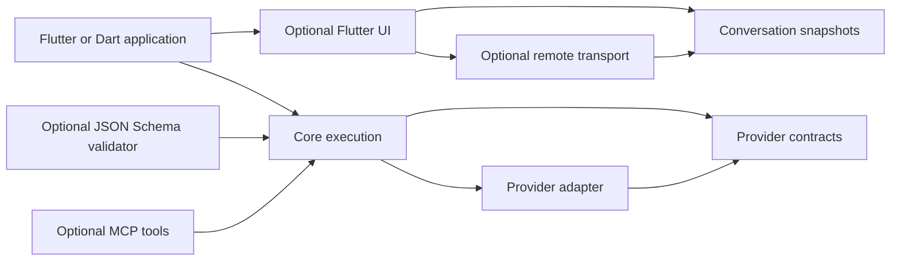

# ADR 0005: v3 execution and conversation contracts

Status: accepted implementation target; qualification is tracked separately in `plans/v3-execution.md`.

Baseline: Dart packages 2.0.0 at `b702929811281ac6be4c5ea2c10004b412b74924`. Upstream comparison: Vercel AI SDK 7.0.111, provider 4.0.17, commit `e9c1d2f54da6bd01a16bb8a5fdfcb4b62f34e7d0`. The approved report is `plans/v3.0.0-report.md`. This decision does not assert that the working tree already implements every row.

## Ownership and dependencies

The provider package owns wire-independent model interfaces, content parts, usage, errors, and the transport abort signal. Core owns request execution, tools, output validation, and generation results. Provider implementations translate those contracts into provider protocols. Conversation owns versioned application state and codecs; it must not execute tools or fetch files while decoding. Remote transport and Flutter UI consume conversation state. JSON Schema validation remains an optional companion dependency.



A companion must not create a reverse dependency from provider contracts or core. The wire-independent conversation codec needs no core dependency until an explicit message converter uses it. Framework integrations remain optional.

## Public generation contract

| Surface | v3 decision | Migration |
|---|---|---|
| `instructions` | Canonical top-level instruction; retained across steps until explicitly overridden | Keep deprecated `system` fallback during v3; `instructions` wins if both supplied |
| `allowSystemInMessages` | False by default; reject system-role input messages before contacting a provider, including prepared messages | Explicit true preserves trusted legacy histories; never convert them to user messages |
| `prepareStep` | Receives current instructions; non-null override persists for subsequent steps; empty string clears instructions | Message compaction changes model context only, never generated response history |
| `usage` | Sum of known usage across all steps; unknown counters stay unknown rather than fabricated zero | `finalStep.usage` for last-step accounting; deprecated `totalUsage` is the same aggregate |
| `content`, tools, sources, files, warnings | Chronological all-step collections, each item once | Read the corresponding `finalStep` collection for final-step behavior |
| `text`, structured `output` | Text and validated output from the final step | Do not concatenate intermediate tool-loop text into a final JSON object |
| `finalStep` | Complete final step, including content, usage, request/response, metadata, response messages and finish reason | On successful generation at least one step exists; an operation that cannot produce a step fails |
| `responseMessages` | Only new assistant/tool messages generated in this call, in order | Append once to the caller's history; never return the supplied history as generated content |
| `onEnd`, `onStepEnd` | Canonical completion callbacks | Deprecated `onFinish`/`onStepFinish` fallback; canonical callback wins and fires once |
| Start/tool callbacks | Stable `onStart`, `onStepStart`, `onToolExecutionStart`, `onToolExecutionEnd` | Deprecated experimental names forward only when canonical callback absent |
| `stream` | Canonical exhaustive event stream, with typed variants and unknown provider data kept opaque | Deprecated `fullStream` exposes the same stream, not a second producer; the old raw-provider `stream` moves to `providerStream` |
| Body inclusion | Typed inclusion policy, request/response bodies and raw chunks off by default | Explicit opt-in; finish metadata and usage remain available without captured content |

Deprecated v2 names remain for the v3 major line where their types can remain unambiguous. The existing `StreamTextResult.stream` is a provider-part stream; v3 deliberately repurposes that name for the exhaustive core event stream and moves the provider view to `providerStream`. This is a documented major-version type change, with old `fullStream` retained as an alias for the canonical core stream. Removal requires a later major release and migration notes; there is no silent removal in this work. These are public migration aliases, not duplicated internal execution paths. Core helpers and examples use canonical names once migration lands.

The upstream `text` remains final-step text even while `content` aggregates. Final-step reasoning access follows upstream; do not infer that every scalar or collection should be aggregated merely because usage is aggregated.

## Execution lifetime

Each public operation owns an internal cancellation scope. A pre-cancelled caller token prevents invocation. Caller cancellation, deadline expiry, source errors and validation failure settle all result surfaces and signal the provider's transport. A late provider completion cannot change the terminal outcome. Cancellation cleanup failures must not replace the first failure or escape unhandled.

Timeouts have distinct meanings:

| Deadline | Starts | Ends / resets |
|---|---|---|
| Total | Public operation entry | Final result or terminal failure; includes queueing, retries, tools and parsing |
| Step | Start of one model step | Step completes, including its streamed response |
| First chunk | Start of provider stream acquisition | First meaningful stream event; silent startup must expire |
| Chunk | Last received stream event | Next stream event resets the idle timer |
| Tool / named tool | Immediately before execution | Tool settles; request cancellation also reaches the tool |

The earliest active deadline wins. `timeout` is the total-duration shorthand; `TimeoutConfiguration` supplies finer text controls. Cancellation is cooperative at user tool boundaries: the SDK can settle its result and signal the tool, but cannot undo external effects. No automatic replay of a possibly executed tool follows cancellation or transport failure.

One-shot helpers share the same total/cancellation rules. Streaming helpers own upstream subscriptions. Deadline during asynchronous stream startup requires disposing of any late-arriving stream. Detach caller-token observers and timers after completion; a reusable caller token must not accumulate completed requests.

## Schema and incremental output

`Schema.decoderOnly` explicitly delegates acceptance to the decoder. Existing `Schema` without a validator has that same behavior. `validatedJsonSchema` in `ai_sdk_json_schema` runs a declared JSON Schema validator before decoding. Supported dialects, local-reference behavior and resource bounds are documented; no implicit network schema resolution occurs.

Incremental object snapshots are immutable JSON maps, not partially initialized application values of type `T`. JSON repair may help preview incomplete content. Final output requires complete syntactically valid JSON and successful schema validation/decoding. The decoder runs once for the final object. Invalid final output retains a typed cause without inserting prompt contents into exception summaries. `streamText` structured output must obey the same boundary.

## Context and approval

Generation context and tool context are separate explicit inputs. The generation context is visible to request lifecycle and prepare-step callbacks. A typed per-tool context wrapper binds application context to the executor without putting it into provider prompts or persistence by default. A migration fallback may expose existing `runtimeContext`, but no implicit copying of secrets into model messages is permitted.

Approval policy belongs to the request or agent, with a per-tool selector when needed. A reusable tool defines its schema and execution behavior. Legacy tool-local policy is honored only when no request-level policy overrides it. A restored approval is bound to the exact call ID, tool name, arguments and policy revision; changed arguments or policy require a new decision. Decode, restore and approval display have no execution side effects. An approval decision does not imply an executed result. Tool execution remains serial by default; bounded concurrency is an explicit option, and completion order must not corrupt call/result association.

## Media, files and provider identity

Canonical file data distinguishes bytes, URL and opaque provider reference. Each carries media type and optional name. Provider references retain their provider namespace and ID and cannot be sent to an unrelated provider as arbitrary URLs. Preserve reasoning files and signatures as opaque provider data. Existing image-input conveniences may construct canonical files, but must retain image-specific detail options.

Provider interface suffixes describe a semantic contract, independently of package 3.0.0. Keep current suffixes until a field/event comparison justifies migration. In particular, adding embedding limits and cancellation does not by itself make Dart `EmbeddingModelV2` a complete upstream V4 implementation. A published compatibility matrix identifies each adaptation and omission.

OpenAI Responses becomes the default only after tool, continuation, multimodal, structured-output and migration fixtures qualify it. Explicit `.chat(id)` and `.responses(id)` factories are available independently of that default. Open model ID strings remain valid; dated capability descriptors advise rather than reject unknown models.

## Conversation wire schema

The initial persistence schema is version 1, independent of package major version:

```json
{
  "schemaVersion": 1,
  "id": "conversation-1",
  "messages": [{
    "id": "message-1",
    "role": "assistant",
    "status": "interrupted",
    "parts": [{"id": "part-1", "type": "text", "text": "Partial answer"}]
  }]
}
```

Stable message and part IDs survive encode/decode, retransmission and UI rebuilds. Tool call IDs identify invocations separately from part IDs. Text, reasoning/signature, file reference, source, tool call, tool result and approval have typed variants. Unknown part kinds and extension fields round-trip without coercion or dropping information. All retained JSON containers are recursively immutable; non-JSON objects, cycles and excessive resource use fail with a typed validation error.

Interrupted and pending-approval states survive restart. Reconnection does not invent a fresh tool invocation for a known call ID. Pending approvals refer to a real call and cannot be mistaken for completed tool results. Unknown schema versions fail explicitly until a tested migration exists; decoding cannot silently reinterpret future versions as version 1.

Remote/Vercel transport maps protocol events to this state through a reducer. A transport adapter is not a persistence format, and a persistence codec is not a provider-prompt converter. Transport auth, request cancellation, errors and reconnect behavior require a pinned reference-server fixture before compatibility is claimed.

## Acceptance and consequences

Each migration row needs a public-API regression plus compiling old/new examples where a fallback exists. Provider mappings need actual request/event fixtures, including multi-turn signature replay. Conversation needs mutation, malformed-wire, interruption/restart and unknown-field round trips. Protocol work needs real socket tests in addition to scripted transports.

This design adds optional packages and migration work. Strict embedding cardinality, default system-message rejection, final JSON validation and body omission intentionally surface behavior that v2 tolerated. Benefits must be demonstrated with fixtures and measurements; no speed, parity or production-readiness claim follows from this ADR alone.

## Sources

- [Pinned result contract](https://github.com/vercel/ai/blob/e9c1d2f54da6bd01a16bb8a5fdfcb4b62f34e7d0/packages/ai/src/generate-text/generate-text-result.ts)
- [AI SDK 7 migration guide](https://ai-sdk.dev/docs/migration-guides/migration-guide-7-0)
- [Pinned provider tree](https://github.com/vercel/ai/tree/e9c1d2f54da6bd01a16bb8a5fdfcb4b62f34e7d0/packages/provider/src)
