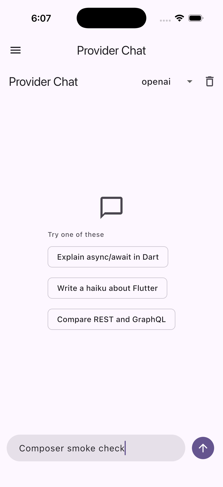

# Codebase slop audit — 2026-09-07

The audit started from `origin/main` at `d7c1cf2b`. The worktree was clean and had no commits ahead of or behind that base.

Six Luna investigators covered all 13 library packages, three examples, tests, manifests, tooling, and documentation. A second pass reviewed core and provider changes independently. The parent reviewed the findings and diffs and ran the final checks.

The main problems were redundant internal layers, impossible defensive branches, weak assertions, copied parsing mistakes, and stale repository scaffolding. No published API was removed.

## Findings and fixes

Paths below identify the affected files. For deleted code, inspect those files at the base commit above.

### Dead code and unnecessary layers

| Finding | Location | Fix and reason |
| --- | --- | --- |
| A private interface, one implementation, ten forwarding methods, and a five-way presence check wrapped nullable fallback factories. | `packages/ai_sdk_dart/lib/src/registry/custom_provider.dart` | Store the factories directly as private fields. Resolve the map entry once, then call the matching fallback. Keep the public factory and model lookup API. |
| `observeFutureError` only called `Future.ignore`; `moveNextOrCancellation` only forwarded `iterator.moveNext()`. | `packages/ai_sdk_dart/lib/src/core/cancellation.dart`, `stream_text.dart`, `streaming/tool_execution.dart` | Call the Dart API and shared cancellation function directly. Remove the wrappers and the redundant `unawaited` call after `ignore`. |
| A no-op telemetry recorder allocated attributes before returning a no-op span. | `packages/ai_sdk_dart/lib/src/telemetry/telemetry.dart` | Return the existing no-op span immediately when no recorder exists. Keep the span implementation, which serves a real purpose. |
| A resource subscription generation counter was incremented but never read. Its wrapper became a container for one controller. | `packages/ai_sdk_mcp/lib/src/mcp_client.dart` | Delete the counter and wrapper. Use controller identity for the existing stale-subscription checks. |
| An example navigation function merely called another helper. A disabled composer used a standalone no-op callback. | `examples/advanced_app/lib/main.dart`, `lib/pages/tools_chat_page.dart` | Remove the extra forwarding function and inline the required disabled callback. |
| An example fake model repeated model metadata and supplied an unimplemented streaming method. | `packages/ai_sdk_dart/example/example.dart` | Reuse the existing fake model implementation. The offline example remains runnable. |
| An unused fixture loader searched many possible directories. Five custom matchers were unused; the remaining matcher only wrapped `throwsA(isA<T>())`. | `packages/ai_sdk_dart/test/conformance/helpers/fixture_loader.dart`, `helpers/matchers.dart` | Delete both files and inline the standard matcher at its callers. |
| Twelve JSON specification files had no executable consumers after their loader became unused. | `packages/ai_sdk_dart/test/conformance/specs/` | Delete the orphaned files and the README claim that they drive the tests. Keep the fixtures actually loaded by wire and stream tests. |
| A private cancellation option was always false. Deferred status-notification branches had no callers. | Flutter UI `chat_controller.dart`, `completion_controller.dart`, `object_stream_controller.dart` | Remove the unused option, its partial-message branch, and the unreachable deferred status calls. Keep the public stop behavior and immediate status notifications. |

### Dart idioms and avoidable work

These findings concern code shapes, not the background of their authors. JSON maps at wire boundaries and simple indexed numeric loops are appropriate Dart.

| Finding | Location | Fix and reason |
| --- | --- | --- |
| Provider callbacks returned `FutureOr`, but callers wrapped them in `Future.value` before awaiting them. | OpenAI, Anthropic, Google, Azure, Cohere, Groq, Mistral provider files; `ai_sdk_openai_compatible/lib/src/openai_compatible_chat_language_model.dart` | Await the callbacks directly. Dart already accepts synchronous and asynchronous results. |
| JSON response formatting repeated casts after the same type check. Tool result serialization used another cast after a type check. | `packages/ai_sdk_openai_compatible/lib/src/openai_compatible_chat_language_model.dart` | Narrow one local value and use Dart patterns for sealed values. |
| Multimodal content used both `null` and an empty list to mean no content. | Same OpenAI-compatible file, `_toContentParts` | Return a non-nullable list and check `isNotEmpty` once. |
| Usage totals were collected in seven temporary lists, then folded. | `packages/ai_sdk_dart/lib/src/core/shared/common_helpers.dart` | Accumulate nullable integers directly. Preserve the difference between missing counts and reported zero counts. |
| Immutable snapshots copied the same list twice. Base64 image decoding copied an already typed byte buffer. | `packages/ai_sdk_dart/lib/src/core/partial_json.dart`, `generate_image.dart` | Use `List.unmodifiable(values)` and `base64Decode` directly. |
| ID generation drew random bytes and reduced them modulo an alphabet length that does not divide 256. | `packages/ai_sdk_dart/lib/src/utils/utils.dart` | Draw indices with `Random.secure().nextInt(alphabet.length)`. This also removes the intermediate mapping pass and modulo bias. |

### Impossible branches and hidden parsing bugs

| Finding | Location | Fix and reason |
| --- | --- | --- |
| JSON decoders checked for a typed map, then retained a generic-map fallback that the decoder could never produce. Coverage exclusions hid the dead branches. | Core `generate_object.dart`, `generate_text.dart`, `stream_object.dart`, `streaming/structured_output.dart`; Anthropic, Google, OpenAI-compatible parsers | Remove the impossible fallbacks and their exclusions. Retain rejection of non-object JSON. |
| Sealed tool choices and tool result outputs had an unreachable fallback after handling every variant. | Core `shared/tool_selection.dart`; OpenAI-compatible and Google tool result serialization | Use exhaustive switches so a new variant requires an explicit implementation. |
| JSON patch comparison included recursive map/list equality that the caller's structural recursion had already handled. | `packages/ai_sdk_dart/lib/src/core/stream_object.dart` | Delete the unreachable recursion and use scalar equality at the remaining call site. |
| Embedding parsers used `cast<double>()` on JSON numbers and indexed input values without bounding response rows. | Azure, Cohere, Mistral, Ollama provider files | Convert each `num` with `toDouble()` and bound rows by the input count, as the OpenAI implementation already does. Verify mixed integer/fractional vectors and extra response rows. |
| Annotation parsing blindly cast every entry to a map. | `packages/ai_sdk_openai_compatible/lib/src/openai_compatible_chat_language_model.dart` | Skip malformed entries and continue processing valid annotations. |
| A zero batch concurrency limit could leave a loop running forever; negative limits also failed incorrectly. | `packages/ai_sdk_dart/lib/src/core/embed_many.dart` | Reject nonpositive `maxParallelCalls` before batch processing. |
| Batched embedding usage converted explicitly reported zero tokens to an unknown count. | Same `embed_many.dart` file | Use a nullable token accumulator. Verify unknown, zero, and mixed reports separately. |
| Retry delay calculation shifted an integer before applying a cap, allowing overflow at large retry counts. Parsed `Retry-After` values could be nonfinite or overflow when converted to a duration. | `packages/ai_sdk_dart/lib/src/core/retry_helper.dart` | Bound the exponential calculation before overflow and validate the parsed duration. Keep the existing fallback backoff policy. |

### Tests that did not prove their names

| Finding | Location | Fix and reason |
| --- | --- | --- |
| “System instruction is included” finished with `expect(true, isTrue)`. | `packages/ai_sdk_dart/test/conformance/stream_object_conformance_test.dart` | Capture the model request and assert its system instruction. |
| Timeout tests accepted any `Object` error, including unrelated runtime failures. | Core `generate_object_conformance_test.dart`, `stream_object_conformance_test.dart`, `rerank_conformance_test.dart` | Require `TimeoutException`. |
| A stream error test closed a response normally and asserted that a count was at least zero. | `packages/ai_sdk_openai_compatible/test/openai_compatible_chat_language_model_test.dart` | Delete the test. Keep the separate test that injects and asserts a real stream failure. |
| Tests rechecked statically guaranteed model interfaces or singleton types. Some custom-URL tests only constructed a model and checked its ID. | OpenAI, Azure, Cohere, Groq, Mistral, Ollama provider tests | Remove those cases. Keep model IDs, protocol versions, request URL, authentication, ownership, and wire behavior checks. |
| MCP tests checked that a statically typed getter returned a stream or that a constructor stored its argument. | `packages/ai_sdk_mcp/test/mcp_conformance_test.dart`, `mcp_coverage_test.dart` | Remove redundant cases. Keep transport and reconnect behavior checks. |
| Flutter documentation examples were placed in a list and counted without building them. | `packages/ai_sdk_flutter_ui/test/docs_snippets_compile_test.dart` | Mount each example and check for build exceptions. |
| An unknown stream event became an `ignored` snapshot, hiding new events from a conformance check. | `packages/ai_sdk_dart/test/stream_conformance_test.dart` | Fail explicitly for an unhandled event. |

### Lifecycle bugs

| Finding | Location | Fix and reason |
| --- | --- | --- |
| `ChatComposer` captured its initial controller permanently. A replacement controller supplied by the parent was ignored. | `packages/ai_sdk_flutter_ui/lib/src/widgets/chat_composer.dart` | Handle controller changes in `didUpdateWidget`. Dispose only owned controllers. Verify controller replacement and transitions between internal and external ownership. |
| Repeated client closure called a custom MCP transport's close operation repeatedly. | `packages/ai_sdk_mcp/lib/src/mcp_client.dart` | Make client closure idempotent and verify the transport close count. |

### Dependency and agent scaffolding

| Finding | Location | Fix and reason |
| --- | --- | --- |
| Core declared unused runtime dependencies and a generator stack without generated models. Provider contracts declared unused `meta`. | `packages/ai_sdk_dart/pubspec.yaml`, `packages/ai_sdk_provider/pubspec.yaml` | Remove core `collection`, `dio`, `json_annotation`, `freezed_annotation`, `build_runner`, `freezed`, `json_serializable`, and provider `meta`. Retain HTTP dependencies in packages that use them. |
| Example apps declared Cupertino icons without using them. | Both Flutter example `pubspec.yaml` files | Remove `cupertino_icons`. |
| Two Melos configurations duplicated the live Makefile and included unused generator commands. No Melos dependency, CI invocation, or documented command existed. | Root `pubspec.yaml`, `melos.yaml` | Remove unused Melos configuration. Keep the native Dart workspace and Makefile. |
| Coverage tool installation swallowed failures and happened twice in CI. A phony target named a nonexistent command. | `Makefile`, `.github/workflows/ci.yml` | Fail fast on installation, install once, remove the dead target, and mark `run-mcp` phony. Keep the 99% gate. |
| Agent guidance named an old SDK and a stale test count. Bug templates used old package names. Coverage and parity docs overstated or misstated current behavior. | `AGENTS.md`, `.github/ISSUE_TEMPLATE/bug_report.md`, `README.md`, `docs/v6-parity-matrix.md`, historical audit notice | Align instructions with the actual pin and commands. State that coverage applies to published libraries. Identify historical reports as historical. |
| Ignore rules and schema comments described a removed generator workflow. | `.gitignore`, `packages/ai_sdk_dart/lib/src/tools/tool.dart` | Remove unused generator ignore rules and explain the actual schema callback. |

## What the audit retained

- Public model contracts, provider factories, middleware extension points, and error types can have external users. Local usage alone does not prove that SDK API is dead.
- Native/web conditional transport stubs are required for cross-platform imports. Unused fake methods that deliberately fail are valid test boundaries when the interface requires them.
- The core documentation compilation tests protect example API syntax. Their runtime assertions are incidental; replacing a length check with a nonempty check would not improve them.
- Executed provider and stream fixtures remain. Orphaned specification JSON was removed; historical plans that mention it describe the old tree.
- Cancellation, unknown-tool, transport, and error-path guards remain when caller mutation, asynchronous work, or platform behavior can reach them.
- The structured streaming counters and benchmark verify parsing cadence. The snapshot API still copies cumulative arrays, so it retains quadratic total snapshot volume. This audit removes an unnecessary second copy without changing that API contract.
- Provider-specific wire tests, serialization checks, and edge-case regressions remain even when their setup looks repetitive.

## Verification

Baseline: Flutter 3.44.3 / Dart 3.12.2, clean analysis, and 1,308 passing tests through `make test`.

The parent ran the offline core example and the structured-stream benchmark. Object parsing made one decode attempt per complete object at 1 KiB, 64 KiB, and 1 MiB. Array decoding scaled with complete elements rather than text chunks. These are operation-count checks, not a claim of a statistically measured speedup.

The advanced Flutter app built and launched on an iPhone 17 Pro simulator running iOS 26.5. The composer accepted typed text. Controller ownership transitions are covered by widget tests; the screenshot is an app smoke check.

| Check | Result |
| --- | --- |
| `make test` | 1,297 tests passed across all 13 packages and both Flutter examples. |
| `make analyze` and `fvm dart analyze .` | Passed. The root analyzer configuration remains unchanged. |
| `make format-check` | Passed: 245 files, zero formatting changes. |
| `make coverage-check` | Passed: 99.20%, or 7,045 of 7,102 lines. The 99% threshold remains unchanged. |
| `fvm dart run packages/ai_sdk_dart/example/example.dart` | Passed without API keys. |
| `fvm dart run packages/ai_sdk_dart/benchmark/structured_stream_benchmark.dart --json` | Passed the operation-count assertions for all six cases. |
| `fvm flutter build web` in `examples/flutter_chat` | Passed on the final implementation. |
| `fvm flutter build ios --simulator --debug` in `examples/advanced_app` | Passed; simulator launch and composer input checked. |
| `git diff origin/main...HEAD --check` | Passed. |

Provider tests use fake models and local HTTP servers. This verifies request and response behavior without a live vendor account. No packages were published.

The implementation is split into seven commits for provider parsing, batch/retry limits, core layers, core tests, Flutter ownership, MCP lifecycle, and tooling. This report and its screenshot form a separate documentation commit. Remote CI status is reported on the PR.

