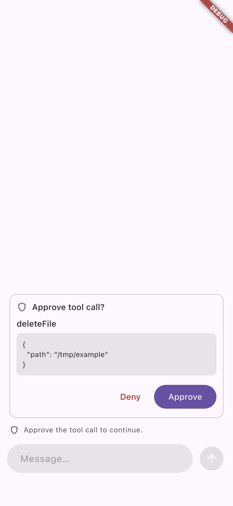
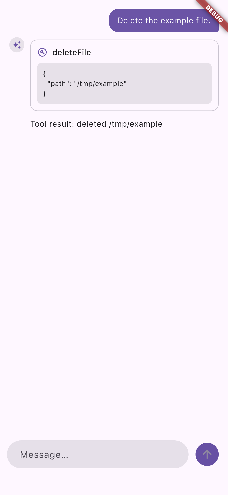

# PR #15 merge review — 2026-10-04

This report continues the [reliability audit](2026-10-04-reliability-audit.md)
at `b6d1c96`, against main at `4ecafc2`. It records the current merge review;
the execution ledger and earlier review reports remain historical evidence.
Merging this PR does not publish any package or qualify live provider accounts.

## Review scope

Three Luna workers audited core/provider contracts, provider adapters, and
conversation/transport/UI packages and examples. The parent reviewed the
integration, repository tooling, CI, and each accepted correction. Independent
GPT-6.1 Sol reviews and final stable-tree gates are recorded below.

The initial Luna core audit found no additional implementation defect. Its
pinned core, provider, JSON Schema, and telemetry suites passed 828, 44, 28,
and 26 tests respectively, with clean scoped analysis. The subsequent Sol
review found the core corrections listed below; the initial audit was not the
final acceptance gate.

## Corrections

### Cohere v2 event framing

The stream decoder attempted to decode every nonempty line as JSON. Real
`event:`/`data:` SSE framing therefore discarded valid output. The correction
recognizes SSE payload lines while retaining existing JSON-line fixtures and
UTF-8 decoding. Regression: `packages/ai_sdk_cohere/test/stream_framing_test.dart`.

### Provider-direct embedding vector validation

Some embedding adapters accepted empty vectors or inconsistent dimensions when
called through `doEmbed`. Core `embed`/`embedMany` already performed validation,
but callers of the provider interface could receive an invalid result. Adapter
validation rejects these payloads and retains HTTP error context. Google,
Cohere, and Ollama now reject empty vectors, inconsistent row dimensions, and
non-finite values, including JSON numeric overflow. Their provider tests cover
each malformed response. These provider-direct defects predated this PR and
were included in the user's requested reliability work.

### Single-embedding validation deadline

`embed` validated the returned vector after its operation scope had closed, so
validation was outside the promised total timeout. Sol reproduced a successful
717 ms call with a 500 ms deadline using a legal lazily decoded vector. The
correction keeps validation inside the operation lifetime, matching `embedMany`.
The deadline remains cooperative: synchronous work cannot be preempted, but an
overdue result must not be returned as a success.

### Legacy MCP notification reconnects

Repeated failures of the optional legacy GET listener retried at a fixed
interval. The correction applies exponential backoff to sustained failures,
resets it after received data, and cancels pending reconnect work on close.
Regression: `packages/ai_sdk_mcp/test/legacy_listener_backoff_test.dart`.

### Disposal with paused stream consumers

Awaiting a broadcast controller's close waits for every paused listener to
resume or cancel. MCP client progress/resource streams therefore blocked
transport cleanup, and notification streams could block HTTP or stdio close.
The same pattern left conversation and remote cancellation disposal futures
pending. Cleanup now initiates stream closure without waiting for consumer
delivery, while retaining ownership cleanup and cancellation. Regressions pause
listeners, verify cleanup completes, and then release the listeners; they do not
add timeout workarounds to the implementation.

### Embedding migration error documentation

The migration guide described every malformed embedding response as
`AiInvalidEmbeddingResponseError`. Core result validation uses that error;
adapters can reject malformed wire data earlier as `AiApiCallError` with HTTP
context. The guide now distinguishes these two boundaries. No exception API
was changed to match the old wording.

### Bloc reentrant close

Disposing an owned backend can synchronously reenter `ConversationCubit.close`.
The old implementation cached the close future only after disposal had started,
allowing duplicate cleanup. Close now caches its future before invoking external
cleanup. `recipe_lifecycle_test.dart` holds disposal open and verifies that
concurrent and reentrant callers all wait, disposal runs once, and Bloc receives
one close notification.

### Generation event and request metadata

Both generation modes omitted `generationContext` from step-start events and
left the canonical request `instructions` field unset. They now carry the
caller's context and initial instructions, including the legacy `system`
fallback. `generation_event_request_contract_test.dart` covers both execution
modes and first-step instruction overrides without changing existing `system`
metadata semantics.

### Telemetry diagnostic isolation

A recorder or span failure was caught, but a throwing `onDiagnostic` callback
escaped the catch and could fail otherwise successful generation. Diagnostic
delivery is now isolated in every recorder, span, and metric failure path.
`telemetry_privacy_test.dart` verifies successful generation and streaming when
both the span and diagnostic callback throw.

### Retry error body privacy

Default body filtering removed payloads from direct API errors but retained them
inside `AiRetryError`. Filtering now recursively removes API response bodies and
data from the final error and all recorded attempts while preserving retry and
HTTP metadata. Explicit response-body retention remains supported.
`core_regression_contracts_test.dart` covers nested filtering and real generate
and stream retry exhaustion.

The second standards pass found another error surface: structured text output
validation attached unfiltered provider response metadata to
`AiNoObjectGeneratedError`. Both generation modes now apply the body policy
before attaching that metadata, including a streamed model that supplies initial
metadata without a later metadata event. Regressions cover default redaction and
explicit body retention.

### Simulated stream opaque content

`simulateStreamingMiddleware` omitted `LanguageModelV4OpaquePart` from generated
content. It now emits `StreamPartOpaque` with the original part.
`core_regression_contracts_test.dart` verifies the emitted type and identity.

### Google late reasoning signatures

Reasoning signatures arriving after the first thought chunk, including an empty
terminal thought chunk, were lost. Google streaming now accumulates the latest
signature and emits it with reasoning-end metadata. The two regressions in
`text_signature_replay_test.dart` failed before the correction and now verify
generated/streamed metadata parity and the next request's thought signature.

The same first-chunk assumption also affected function-call signatures. A
later chunk could carry the signature for an already active call while the
accumulator retained its initial null provider options. This correction and
its replay regression are included in the final provider verification.

### Model-specific reasoning capabilities

Portable reasoning settings used a broad family rule that sent adaptive
thinking to Claude 4.5. Anthropic's [thinking configuration table](https://platform.claude.com/docs/en/build-with-claude/thinking)
documents that Opus, Sonnet, and Haiku 4.5 reject that setting with HTTP 400;
these models require enabled thinking with a token budget. The correction
distinguishes older budget-based models from adaptive-capable models while
retaining explicit provider overrides. Generate and stream tests include
dated Claude 4.0, 4.1, and 4.5 IDs, so a date suffix cannot be mistaken for a
minor model version.

Google's [thinking support table](https://ai.google.dev/gemini-api/docs/thinking)
also distinguishes individual Gemini 3 models. Gemini 3 Pro Preview supports
low/high, so the previous minimal/medium mappings could produce rejected
requests. Gemini 3.1 Pro supports low/medium/high; Gemini 3.1 Flash Lite Image
supports minimal/high, also confirmed by the [image generation documentation](https://ai.google.dev/gemini-api/docs/image-generation).
The correction selects supported levels for these documented model
capabilities. Generate and stream request regressions verify the serialized
settings and explicit provider overrides. These are contract tests against
recorded documentation, not live account qualification.

### OpenAI Responses usage breakdown

Responses reported cached input tokens but the adapter dropped them from typed
usage. That also removed cache accounting from aggregate results and telemetry.
The correction maps reported cache reads, derives uncached input only when both
values are available, and preserves unknown counters. Output text accounting is
derived only when both total output and reasoning counts are known. Generation
and streaming share the corrected mapping.

### Unsupported image rendering

A valid provider-owned image reference reached `imageProviderFor`, which throws
because it cannot load the reference. This happened during widget construction,
before Flutter's image error handler could run, breaking the surrounding chat
message. Sol reproduced the failure through `AssistantMessageView`. The widget
correction renders the existing error placeholder for unsupported image data;
the direct conversion helper can still reject unsupported input.

### Conversation persistence and approval replay

The following corrections were reviewed together because they cross the
codec, local backend, and remote protocol boundaries:

| Defect | Correction and regression scope |
| --- | --- |
| Unknown nested fields in file data disappeared on codec round trips. | Preserve immutable extension maps for image, file, reasoning-file, and redacted-reasoning data, for bytes and provider references where supported. `conversation_test.dart` covers round trips and frozen nested values. |
| Providers can reuse citation IDs on later turns, but conversation part IDs must be globally unique. | Store the provider's `sourceId` separately from a unique conversation part ID. Preserve the provider ID through persistence and replay, and reuse the part ID for updates within one message. Local and remote controller tests cover URL and document citations. |
| Resolving one remote approval marked a message as streaming or complete while another approval was pending. | Preserve pending status until all approvals are resolved, including continuation and reset recovery. `remote_test.dart` covers partial responses and pending state. |
| A mixed automatic/approval tool step replayed automatic results in both assistant and tool messages. | Prefer canonical step response messages and filter local results from reconstructed assistant content. Controller regressions check result role and count after approval resumes. |
| Restored local approvals only updated when their part ID matched an internal naming convention. | Match `ApprovalPart.approvalId` with the same part-ID fallback used during restore, preserving arbitrary valid persisted IDs and extension fields. Controller regression covers restored approval before tool execution. |
| Completed local results were put in assistant messages on the next user turn, causing OpenAI Chat to omit them from its wire request. | Use one role-preserving conversion for ordinary history and approval snapshots. Local results use the tool role; provider-executed results stay with the assistant. The parent reproduced a missing tool message using the real OpenAI Chat adapter and a fake HTTP transport before the correction. |

The advanced tools-chat and basic approval examples used the same duplicated
replay construction. They are updated to teach canonical response-message
replay, preserving the role of each result instead of reconstructing it from
the combined content list.

The second Sol round also reproduced a separate advanced-example next-turn
duplicate. `ToolLoopAgent.resume` exposes the newly executed result in both its
request history and new response history; concatenating those two surfaces
replayed the result twice. The example now builds each turn from the prior
history and newly returned response messages once, retaining earlier replay
history across chained approvals. Tests use exact counts rather than sets of
IDs that could hide duplicates.

## Independent review record

Two GPT-6.1 Sol review rounds covered specification and implementation standards
as separate axes. They reviewed the actual merge-base diff against `4ecafc2`,
including the working corrections. Implementation paths across the packages,
examples, protocols, and tooling were reviewed; historical documents, generated
assets, and some test bodies were sampled.

| Review | Findings and closure |
| --- | --- |
| Round 1, specification | Responses cache counters and duplicated example tool replay; related context, privacy, citation, and replay defects were also sent to the parent during review. All accepted corrections are documented above. |
| Round 1, standards | Unsupported image rendering and late Google tool signatures. Both corrected with regressions. |
| Round 2, specification | Paused MCP cleanup, advanced-example next-turn duplication, and embedding validation outside the total deadline. Independent reproductions pass after correction; no open findings. |
| Round 2, standards | Structured-output error body privacy and model-specific reasoning capabilities. Final frozen delta review reports no findings; 20 independent checks passed across providers, privacy/deadlines, MCP retry timing, and citation/codec/replay paths. |

The parent read the actual correction diffs and independently reproduced local
tool-result loss through the OpenAI Chat adapter. A separate Luna comments and
suppression review found no actionable issues and made no edits. Review findings
are closed; the verification record below describes the separate execution gates.

## Verification record

- At tested head `f14d776` (production code unchanged from `742ecbd`), pinned
  Flutter 3.44.3 / Dart 3.12.2 dependency resolution, whole-workspace analysis,
  and formatting passed (455 files, zero changes).
- `AI_SDK_REMOTE_REFERENCE_URL=http://127.0.0.1:8081/chat AI_SDK_MCP_REFERENCE=1 make coverage-check`
  passed all 1,917 Dart and 304 Flutter package tests. Total line coverage is
  **99.01% (14,373/14,516)**, meeting the unchanged 99% gate. Both pinned
  JavaScript protocol references were enabled.
- `make test-examples` passed: 41 ordinary Flutter cases, 21 fixture-enabled
  provider/media cases, 5 Dart remote examples, and 6 CLI assertions. The
  ordinary Flutter invocation skips 15 cases that need provider defines;
  the subsequent fixture-enabled invocation exercises those paths.
- Repository tooling: 22 tests passed. Catalog: 16 records across 9 providers.
- Pinned JavaScript remote fixture: all 3 tests passed on local Node 24.21.0;
  hosted CI uses Node 22.
- Hosted [CI](https://github.com/codenameakshay/ai_sdk_dart/actions/runs/37197917799)
  and all three [compatibility lanes](https://github.com/codenameakshay/ai_sdk_dart/actions/runs/37197917780)
  passed at `8e1361b`: minimum Flutter 3.41.3 / Dart 3.11.1, pinned
  Flutter 3.44.3 / Dart 3.12.2, and latest stable. Hosted coverage independently
  reported the same 99.01% result.
- Final-code iOS run [37197917882](https://github.com/codenameakshay/ai_sdk_dart/actions/runs/37197917882)
  passed both launches, with 9 screenshots per launch. The parent inspected the
  pending-approval and restored-approved screenshots and verified both launch
  logs. This is scripted-model simulator evidence at `8e1361b`, not live provider
  evidence. [Native evidence](assets/pr15-merge-ios.json) records toolchains,
  screenshot hashes, and the tested commit. The evidence-only follow-up changes
  documentation and assets; final-head checks remain visible on [PR #15](https://github.com/codenameakshay/ai_sdk_dart/pull/15/checks).
- The final-code Flutter chat release web build and Wasm compilation dry run
  passed.
- All five final-code Chromium browser flows passed: local approve/deny, remote text, and
  remote approve/deny. They verified disabled input during approval, restored
  editing afterward, one assistant row, and zero page/console errors. The parent
  inspected desktop approval and narrow-viewport denial screenshots.
  [Browser evidence](assets/pr15-merge-browser.json) records source/build hashes.
- `make benchmark` passed its parse/allocation assertions for 12 cases and 360
  measured samples. Shared-host timing is not a latency improvement claim.
- The initial full coverage run overlapped newly added regressions after source
  compilation; it was stopped and excluded as a stable-tree gate. The first
  stable-tree run passed all 1,916 Dart and 301 Flutter tests, but its 98.93%
  coverage failed the unchanged 99% gate. Follow-up tests cover provider aliases,
  Gemini high reasoning levels, stream invocation failure, approval-resume
  failure after one tool execution, and repeated pure-text retry failure.
  The final stable-tree rerun passed as recorded above; no coverage exclusions
  or thresholds were changed.
- `make dry-run` passed on the clean committed tree: all 17 publishable
  packages reported zero warnings. The unpublished realtime preview is
  intentionally excluded by the repository target. No package was published.

| Pending approval before restart | Restored and approved on the second launch |
| --- | --- |
|  |  |

[Remote denial in a narrow browser viewport](assets/pr15-merge-remote-denied.png).

## Remaining qualification boundaries

Live provider canaries require credentials and explicit account/model choices.
Realtime remains an unpublished preview; live audio, Android, physical devices,
and frame/raster performance require separate qualification. This Linux host
has no iOS or Android device. iOS evidence comes from the hosted simulator job.
Cancellation signals cooperative work; they cannot undo an external side effect
from an application tool that ignores cancellation.
