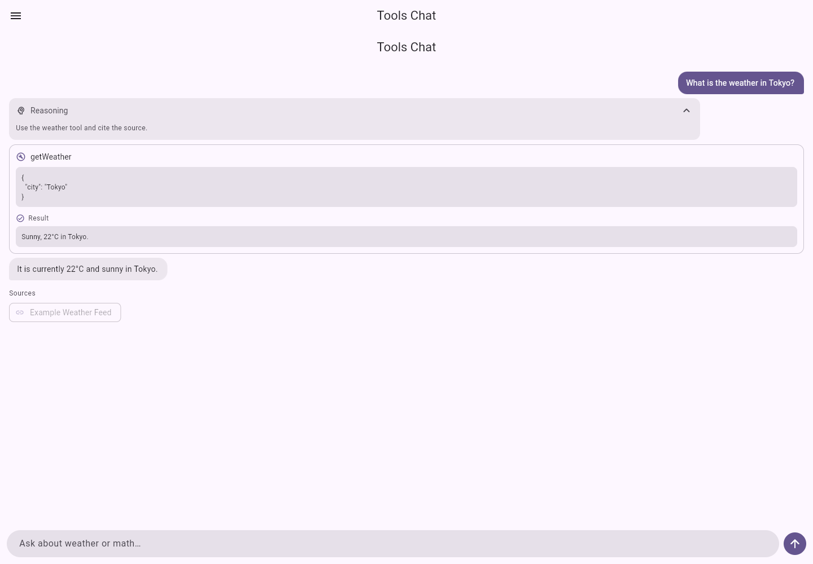
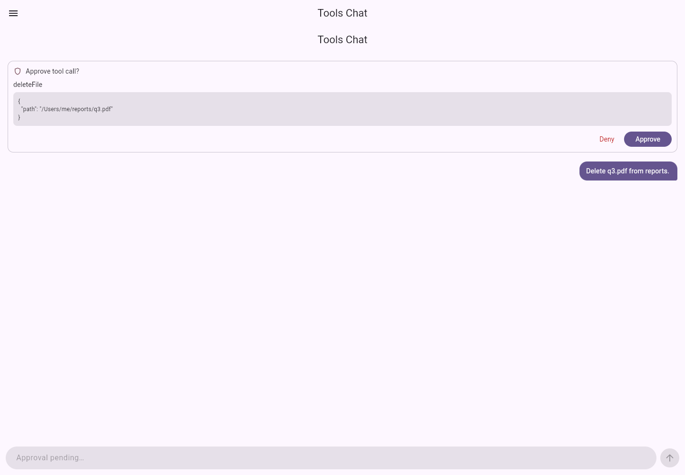
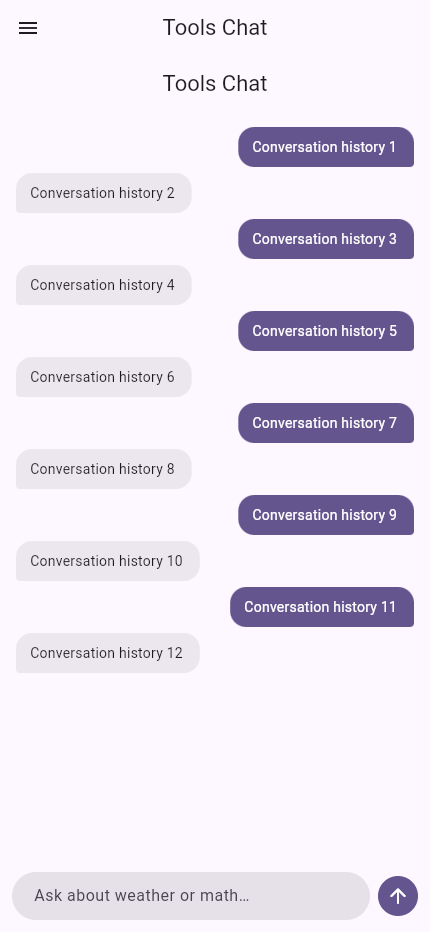

# AI SDK Dart 2.0.0 audit and implementation report

This release is a broad reliability and product-quality pass across the Dart AI
SDK, its provider adapters, MCP transports, Flutter UI package, and examples.
It intentionally removes the obsolete language-model V3 seam instead of
maintaining aliases or fallback paths.

## Contract and API improvements

- Replaced the language-model V3 provider seam with `LanguageModelV4` across
  core, middleware, providers, mocks, tests, docs, and examples.
- Unified function and provider-defined tools in one typed tool list.
- Added typed text/JSON response formats, provider-neutral reasoning controls,
  raw-chunk opt-in, abort signals, supported URL declarations, structured
  warnings, typed request/response metadata, and nested token usage.
- Split streamed tool input (`start`, `delta`, `end`) from the validated,
  complete tool call. Tools execute only after the complete call arrives.
- Added explicit text and reasoning lifecycle boundaries, stream-start warnings,
  response metadata, raw chunks, usage events, approval requests, and complete
  tool result parts.
- Renamed experimental runtime context and telemetry surfaces to stable
  `runtimeContext` and `telemetry` APIs.
- Added explicit tool approval policies: never, conditional, and always.

## Reliability and correctness fixes

- Propagated cancellation into live Dio requests for OpenAI-compatible,
  Anthropic, Google, Cohere, and Ollama language-model requests. Provider
  cancellation now consistently surfaces as `AiOperationCancelledError`.
- Added operation, step, first-chunk, inter-chunk, tool, and per-tool timeout
  scopes. The total budget is shared across the full operation and timeout
  failures are no longer swallowed as tool errors.
- Fixed Google stream lifecycle and usage accounting, Cohere text/tool-call
  finalization, and provider response warning normalization.
- Fixed retry cancellation, retry delay accounting, and non-retryable error
  classification.
- Hardened MCP Streamable HTTP transport for protocol 2025-06-18, session
  reuse, initialized/cancelled notifications, reconnect cursors, safe shutdown,
  and response trust boundaries.
- Removed races from MCP stdio startup/shutdown and prevented `finally` blocks
  from suppressing unexpected client errors.
- Bounded MCP stdio JSON frames at 1 MiB so malformed or malicious child
  processes cannot grow the receive buffer without limit.
- Fixed controller cancellation and disposal behavior so abandoned Flutter
  operations cannot publish stale state.
- Made provider-managed authentication headers authoritative over per-call
  headers, preventing accidental credential replacement while preserving
  non-sensitive custom request headers.
- Fixed structured-stream parsing around fenced JSON, partial arrays, malformed
  elements, and final parse failures.

## Performance improvements

- Reused provider HTTP clients instead of creating a new client per request,
  while preserving caller ownership for injected clients.
- Reduced structured-stream reparsing by tracking meaningful JSON boundaries
  and array element completion.
- Coalesced high-frequency Flutter stream notifications to a frame boundary.
- Added a machine-readable structured-stream benchmark (`--json`) for release
  regression checks.
- Stabilized long-history chat scrolling and avoided unnecessary animated
  scroll work when reduced motion is enabled.

## UX and accessibility improvements

- Added deterministic normal, approval, error, source/tool, and long-history
  fixture states to the advanced example for visual regression testing.
- Improved empty, loading, streaming, error, retry, stop, and tool approval
  states in the prebuilt chat scaffold.
- Added accessible source labels, larger citation targets, keyboard traversal
  and activation, focus behavior, and clearer semantics for interactive cards.
- Blocked automatic loading of URL-backed model images by default; hosts can
  opt in with an explicit image-provider builder after validating the URL.
- Made reduced-motion behavior respond to live platform preference changes.
- Improved scroll-to-latest behavior without stealing position from users
  reading earlier messages.
- Corrected examples and documentation so snippets compile against the current
  public API and run offline in widget tests.

## Developer experience

- Added adapter-backed cancellation tests, V4 provider contract tests, stream
  lifecycle conformance fixtures, timeout tests, accessibility widget tests,
  and offline example navigation tests.
- Added formatting, static-analysis, test, coverage, benchmark, and web-build
  release gates.
- Corrected package development dependencies required by package-local tests.

## Breaking changes

- `LanguageModelV3` and its obsolete language-model types are removed; use the
  corresponding V4 types.
- Provider call options use a unified `tools` list and `responseFormat`; the old
  provider-seam `providerDefinedTools` and `outputSchema` fields are removed.
- `experimentalContext` and `experimentalTelemetry` are now `runtimeContext`
  and `telemetry`.
- Usage is grouped under input/output token details instead of flat totals.
- Streaming tool input completion no longer means a tool is executable; wait
  for the complete tool-call part.

The prompt/content hierarchy and finish-reason representation remain
Dart-native where that keeps the public API coherent, while the provider seam,
stream lifecycle, options, warnings, metadata, and usage model follow the V4
contract used by this release.

## Verification evidence

- Repository format and analyzer gates pass with no issues.
- The complete Dart/Flutter package matrix and both offline example-app suites
  pass.
- Combined line coverage is **99.16% (7107/7167)**, above the enforced 99%
  release threshold.
- Both Flutter web examples build successfully.
- The structured-stream benchmark passes its six-scenario JSON regression
  assertion.
- Independent code and security reviews found no remaining release blockers.
- The final UI detector reported no quality-pattern violations.

## Visual evidence

Additional fixtures cover the
[normal chat](screenshots/next-release-tools-chat.png) and
[retryable error](screenshots/next-release-error.png) states.
