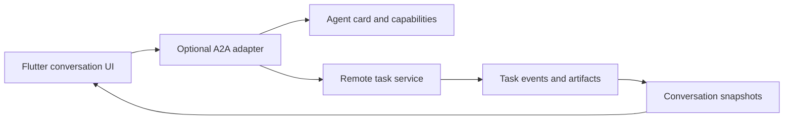

# A2A: optional remote-agent adapter

Status: proposal, not implemented. Work package W20. Protocol research baseline: A2A 1.0.1 from the approved report. No named interoperating deployment is established.

The proposed user is an application consuming another organization's agent as a task service. Admission requires a concrete agent service, supported transport/version, authentication owner and task semantics. An MCP tool server does not by itself establish this need.

## Model and boundary

Use an optional remote-agent package. Model agent discovery, remote task IDs, messages, artifacts, pending input, terminal failure and cancellation explicitly. A remote task can span several conversational turns. Its ID is not a provider response ID or tool-call ID.

The adapter maps task events into conversation snapshots while preserving artifact IDs, media types and provider extensions. Artifact download is an explicit application action with auth and cancellation; decoding a task event must not fetch a URL. Authentication and capability discovery stay separate from model prompts.

## Interoperability proof

Pin one independently implemented reference server. Test discover/send/observe/cancel with its actual protocol, not only a mock. Include tasks that require input, stream several artifacts, fail after partial output, and complete while cancellation races. Reconnect must recover the known task according to server capabilities; it must not submit a duplicate task implicitly.

Verify authorization failure, unsupported protocol versions, malformed/unknown events, artifact size limits and ownership of injected clients. Record server version and transport in a compatibility table. Only describe support for versions/transports actually exercised.

The benefit is remote task interoperability. Costs include server-specific identity, state recovery and artifact lifetimes. Core model generation and MCP discovery remain usable without this dependency.

Sources: [A2A 1.0.1 release](https://github.com/a2aproject/A2A/releases/tag/v1.0.1), [A2A specification](https://a2a-protocol.org/latest/specification/).
