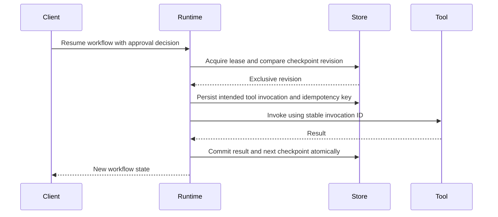

# Durable workflows: optional server package

Status: proposal, not implemented. Work package W20. This is independent of the v3 core release.

The proposed user is a backend team whose tool run must survive a process crash and await human approval for hours or days. No named adopter or storage owner has been established in this repository. The admission gate is a concrete workflow, its deployment topology, expected concurrency, and a maintainer responsible for storage migrations. A local chat transcript alone does not justify a workflow engine.

## Boundary

Keep checkpoint storage and leasing in an optional server package. Core continues to execute a single request; conversation continues to encode application state. A workflow runtime calls core at a checkpoint boundary and persists the outcome before advancing its state machine. Flutter clients observe workflow events through a trusted backend. They do not hold database or lease credentials.

## Required contract

Each checkpoint carries a schema version, workflow definition version, workflow/run IDs, monotonically increasing revision, status, generated conversation state, outstanding approvals, tool invocation IDs, and recorded outcomes. Secrets are resolved at execution time and never embedded in checkpoints. Approval decisions bind the exact call and policy revision.

A lease has a fencing token, owner and expiry. Every mutation compares the expected revision and fencing token. Lease renewal cannot authorize a stale worker after another worker takes ownership. Unknown workflow versions require an explicit migration or an explicit refusal to resume.

Tool idempotency is an application contract. A crash after a side effect but before checkpoint commit produces an ambiguous invocation. The runtime must surface that state or query a tool-specific receipt; it cannot promise exactly-once execution merely by saving a checkpoint. Automatic retry requires an idempotent operation or a stable deduplication key honored by the external service.

## Admission prototype and proof

Implement one transactional persistent store after an adopter chooses the deployment target. An in-memory implementation may serve tests but cannot be the durability evidence. Kill the worker before and after every persistence/side-effect boundary; restart in another process and verify recorded results, stable IDs and approvals. Race two workers, expire and steal leases, reject stale writes, interrupt network access, migrate one older checkpoint version, and test tenant isolation.

Measure checkpoint size, write amplification, lease contention, recovery time and duplicate-effect rate. Release documentation must distinguish resumable model work, idempotent tool work and ambiguous external effects. A provider HTTP timeout is not evidence that a tool failed to execute.

The benefit is recovery and long-lived approvals. The costs are storage operations, migrations, lease ownership and a larger operational surface. This must not become a mandatory dependency for a mobile text-generation request.

Reference: [Vercel WorkflowAgent](https://ai-sdk.dev/docs/agents/workflow-agent). Verify the chosen runtime and pinned SDK version before prototype implementation.
