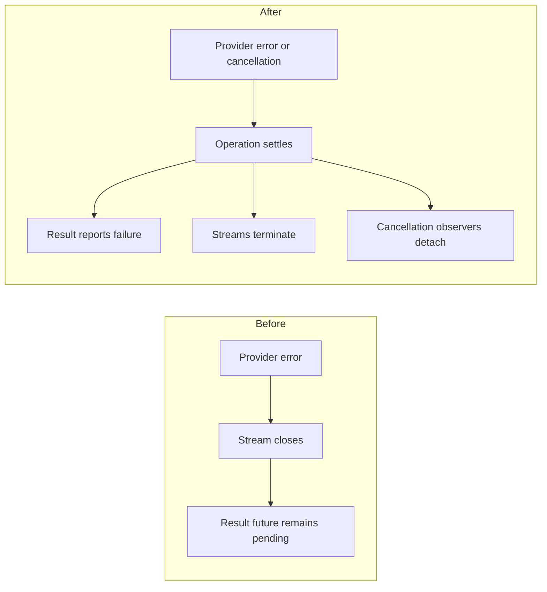
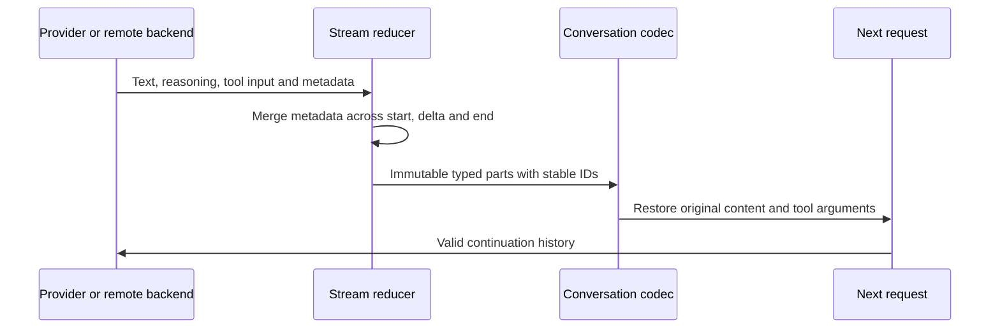
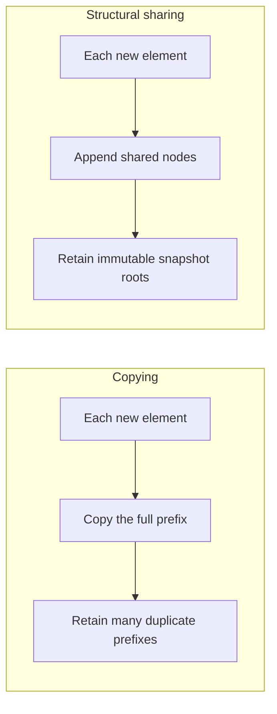
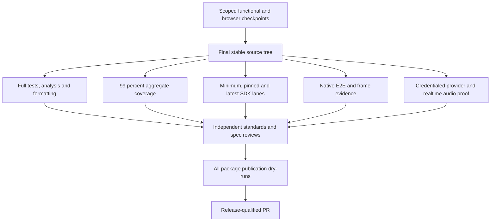

# v3 changes: behavior and qualification

This is an implementation checkpoint, not a release certificate. PR [15](https://github.com/codenameakshay/ai_sdk_dart/pull/15) tracks the remaining gates. The [execution ledger](v3-execution.md) records test scopes and revisions.

## Request failure

Before, a structured source error could leave the result future pending even after its streams closed. Now the operation settles its result surfaces and releases its request lifetime.

The core terminal-state, cancellation, and conformance tests exercise these boundaries. A cooperative cancellation token cannot forcibly stop arbitrary application code that ignores it.

## Conversation continuation

Before, completed remote tool history omitted the original input, and metadata could disappear between stream events and persisted history. Those losses can make the backend reject the next request or prevent correct provider continuation.

The current remote checkpoint passes 50 tests, including requests accepted by the pinned JavaScript server. That server uses scripted model responses; it proves transport behavior, not current hosted-model acceptance. Unsupported remote redacted reasoning and opaque provider references fail explicitly.

## Structured snapshots

| Isolated measurement | Before | After | Limit |
| --- | ---: | ---: | --- |
| Median retained heap, 4,000 integer prefixes | 64,277,072 bytes | 996,296 bytes | 30 fresh processes per mode; this fixture only |
| Median 1 MiB parser time | 155.400 ms | 112.036 ms | 30 measured samples; small-case maxima regressed |

[Raw measurements, source hashes, and methodology](v3-research/evidence/benchmarks/README.md) are the authority for these figures. They do not establish mobile frame performance or live-provider speed.

## What improves, and what costs more

| Change | Improvement | Cost or unresolved limit |
| --- | --- | --- |
| Strict terminal-state and embedding validation | Malformed output fails at the boundary instead of hanging or silently misaligning results | Previously accepted invalid responses now fail |
| Aggregate results and explicit final step | Multi-step usage and content remain available | Breaking migration for callers that assumed last-step aggregate fields |
| Rich typed conversation persistence | Provider continuation retains images, reasoning and tool arguments | More explicit types and unsupported-transport errors |
| Bounded tool concurrency | Independent I/O tools can overlap | Tools must be safe to run concurrently; synthetic timing is not provider throughput |
| Shared structured snapshots | Lower retained allocation for large histories | More internal structure; no universal latency improvement |
| Separate companion packages | Optional remote, telemetry and realtime surfaces | A larger compatibility and release-test matrix |

## Evidence still required

The first simulator job timed out after a successful build, before producing test results. Diagnostic execution is in progress. Retry/localization, coverage, native performance, and live qualification remain open. No merge or publication is authorized by this checkpoint.
