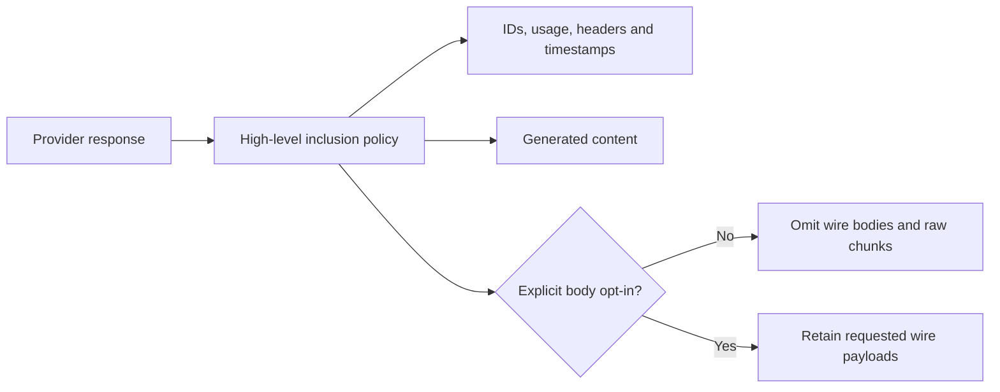

# Body retention checkpoint

The v3 API now has a typed `BodyInclusionPolicy`. The default omits request
bodies, response bodies and raw chunks from high-level result views. Response
IDs, timestamps, headers and usage remain available. Explicit inclusion keeps
wire payloads when an application needs to debug an integration.

This changes the high-level SDK result contract. Direct provider calls remain
the lower-level wire interface; an application calling `doGenerate` directly
must own its retention policy.

| Before | Current change | Tradeoff |
|---|---|---|
| High-level envelopes retain wire request/response bodies by default | Retention requires explicit policy | Existing diagnostic consumers must opt in |
| Request/result settings differ between convenience entry points | Text, object and agent entry points accept the policy | More public signatures and migration work |
| API error causes may retain provider payloads | Omitted-body errors retain status/code/retry fields and drop body-bearing cause data | Less raw error detail by default |

This is body minimization, not automatic removal of sensitive generated content
or all secrets from headers, messages, URLs or arbitrary provider metadata.
Applications still decide what content and metadata they store or export.

## Evidence and remaining proof

Parent full core run: 714 passed, `/tmp/v3-core-w15-parent-tests.log`.
Parent full OpenAI run: 111 passed, `/tmp/v3-openai-parent-after-w15.log`.

Review found that the initial four body-policy tests do not directly assert all
surfaces described by their titles. A test that checks `onError` does not prove
the provider-event stream omits bodies. A test that reads `steps` does not prove
the step callback or `finalStep` view. Stronger assertions for those views, object
generation/streaming, and explicit legacy raw-chunk inclusion are assigned.

No memory reduction or speed claim follows from these tests. The implementation
still receives provider payloads and must process them before publishing filtered
views. Retained-memory measurements and optional metrics/exporter work remain.
