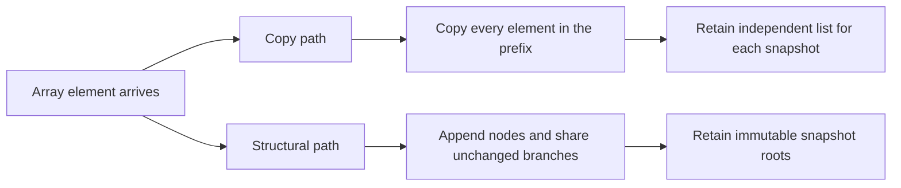

# Structured-stream comparison, 30 runs

## Incremental object previews (2026-09-23)

The current benchmark compares final-only object parsing with repaired incremental previews on the same source and payload. Each case has three warmups and 30 rotating samples on a shared macOS arm64 host with pinned Dart 3.12.2. [Raw samples and source hashes](object-preview-comparison.json) include every observation.

| Object payload | Final-only p50 | Incremental p50 | Incremental parse attempts |
| --- | ---: | ---: | ---: |
| 1 KiB | 0.247 ms | 1.063 ms | 8 |
| 64 KiB | 4.891 ms | 9.774 ms | 14 |
| 1 MiB | 93.734 ms | 196.141 ms | 18 |

The 1 MiB incremental path costs about 2.09 times the final-only median CPU time in this fixture. In exchange, it exposes immutable previews before closure. Checkpoints grow geometrically, so parse attempts do not grow with every token. This comparison is not a historical release, network, allocation-byte, or Flutter frame result. The older Linux measurements below use different source and hardware; do not compare their absolute times to this table.

Command: `make benchmark`. Runtime: Dart 3.12.2, Linux aarch64. Raw samples and source hashes: [JSON](structured-stream-30-runs.json).

| Payload | Path | p50 ms | p95 ms | empirical p99 ms | Full-list elements copied | Structural nodes |
|---|---|---:|---:|---:|---:|---:|
| 1KiB | object | 0.294 | 2.475 | 2.675 | 0 | 0 |
| 1KiB | array-copy | 0.298 | 1.976 | 2.474 | 10 | 0 |
| 1KiB | array-structural | 0.278 | 1.923 | 3.115 | 0 | 7 |
| 64KiB | object | 5.320 | 8.600 | 10.065 | 0 | 0 |
| 64KiB | array-copy | 7.022 | 10.609 | 10.983 | 29890 | 0 |
| 64KiB | array-structural | 6.937 | 9.869 | 15.921 | 0 | 483 |
| 1MiB | object | 92.735 | 101.620 | 114.038 | 0 | 0 |
| 1MiB | array-copy | 155.400 | 173.990 | 176.846 | 7505875 | 0 |
| 1MiB | array-structural | 112.036 | 129.612 | 144.711 | 0 | 7742 |

For the 1 MiB fixture, the structural path reduced median processing time from 155.400 ms to 112.036 ms (27.9%) and avoided 7,505,875 full-list element copies. It still allocated 7,742 structural nodes and copied 22,753 root references. These are measurements of this fixture on this host, not a claim about network latency or every application.

The small fixtures show a tradeoff: the structural path had a worse observed maximum at 1 KiB (3.115 vs 2.474 ms) and 64 KiB (15.921 vs 10.983 ms). Thirty observations cannot establish a reliable population p99 or explain those outliers; retain the raw samples instead of hiding them behind the median.

Each case receives three warmups and 30 measured runs. Case order rotates on each iteration. All observations enforce the parser/snapshot operation budgets. The copy path and structural path use the same generated trace; this is a controlled algorithm comparison within the current source, not a historical whole-release comparison.

This run used a shared VM without CPU isolation. Heap/allocation-byte profiles, cancellation timing, serialization/event-delivery timing, and Flutter build/raster distributions remain required before the full W13 performance gate is complete. No CI timing threshold is calibrated from this single run.

## Retained snapshot heap

Run each mode in a fresh process:

```sh
fvm dart run packages/ai_sdk_dart/benchmark/snapshot_retention_benchmark.dart copy
fvm dart run packages/ai_sdk_dart/benchmark/snapshot_retention_benchmark.dart structural
```

The parent ran 30 samples per mode, alternating which mode ran first in each
pair. [Raw results and source hashes](snapshot-retention-30-runs.json) include
each process's runtime and heap measurements. The fixture retains all 4,000
prefix snapshots of one integer array and verifies every retained prefix after
the final append. The VM service forces GC before measuring baseline and final
live heap. This isolates snapshot retention, not JSON decoding or provider I/O.

| Median across 30 fresh processes | Copy | Structural |
|---|---:|---:|
| Post-GC retained heap delta | 64,277,072 bytes | 996,296 bytes |
| Process peak RSS | 283,371,520 bytes | 218,492,928 bytes |
| Snapshot construction time | 86.302 ms | 19.673 ms |

Retained heap falls by 98.45% for this deliberately retention-heavy fixture.
Process peak RSS includes the VM, compilation, and profiling overhead; it is
not peak SDK heap. The fresh-process timing includes JIT effects and is not a
replacement for the warmed parser benchmark above. Ordinary consumers may
discard old snapshots, so their savings can be much smaller. No historical
release, Flutter device, general allocation-rate, or network claim is made.



Both paths preserve old snapshot values when new elements arrive. The changed
ownership of storage explains the measured reduction; structural nodes still
cost memory and can add access overhead for small snapshots.

## Opt-in tool scheduling

`fvm dart run packages/ai_sdk_dart/benchmark/tool_concurrency_benchmark.dart --json`
completed in the parent with 12 synthetic 25 ms I/O futures. Serial scheduling
took 317.719 ms (peak 1); explicit concurrency 4 took 77.580 ms (peak 4).
[Raw result and source hashes](tool-concurrency-single-run.json) preserve this
single-sample demonstration. It shows overlapping independent waiting work;
it does not establish a provider speedup or a latency distribution. Serial
remains the default. Opting in increases simultaneous resource usage and can
hit service limits sooner; callers must know their tools can run independently.
