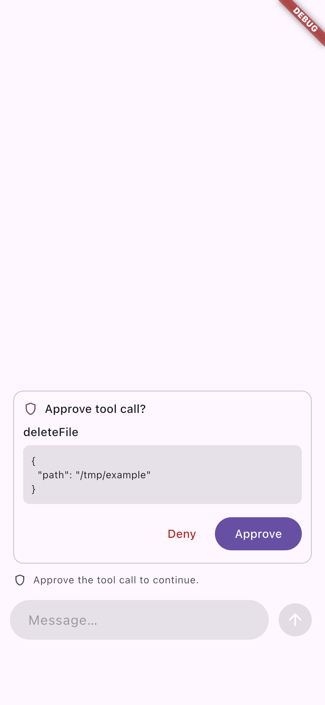
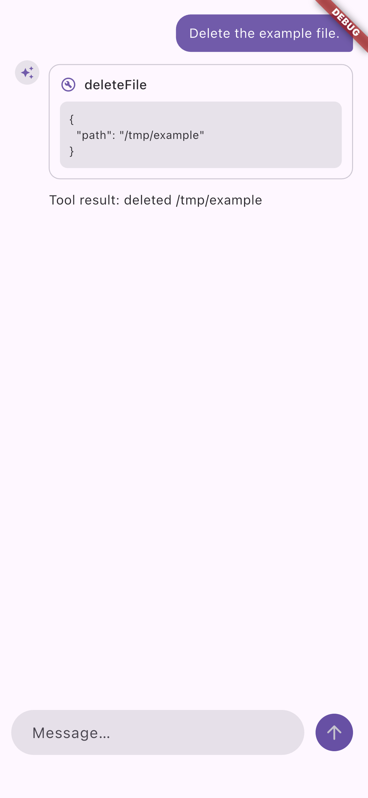
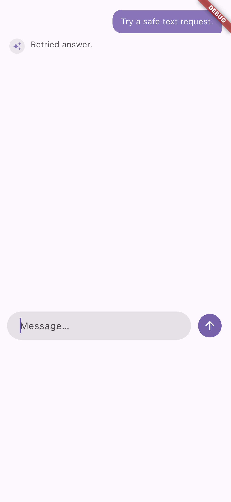

# Native conversation checkpoint at `d4b65e6`

[GitHub run 35897437862](https://github.com/codenameakshay/ai_sdk_dart/actions/runs/35897437862) built once, installed once, and attached to the same iOS Simulator app twice. Both `flutter drive` runs ended with `All tests passed`; the workflow enforced at least eight screenshots per run and retained nine per run. It checked that run 1 had only the write marker and run 2 had only the restore marker. The runner used Flutter 3.44.3, Dart 3.12.2, and Xcode 15.4. Full logs and all screenshots remain in the workflow artifact.

| Before process restart | After process restart | Safe text retry |
| --- | --- | --- |
|  |  |  |

The restart test uses a real `LocalConversationBackend`, a fresh `ToolLoopAgent`, a serialized conversation snapshot, and a counted executor. It asserts no provider call or tool execution on restore, stable message IDs, one user turn, and one tool execution after approval. The retry test asserts one user turn, stable message IDs, and two model calls after a failed text-only first attempt. The screenshots show the visible states; the assertions in the test and retained logs carry the behavioral proof.

This is a scripted-model simulator test, not a provider canary, physical audio test, screen-reader audit, profile-mode frame trace, or release certificate. Exact-head CI still fails the 99% aggregate coverage gate.
