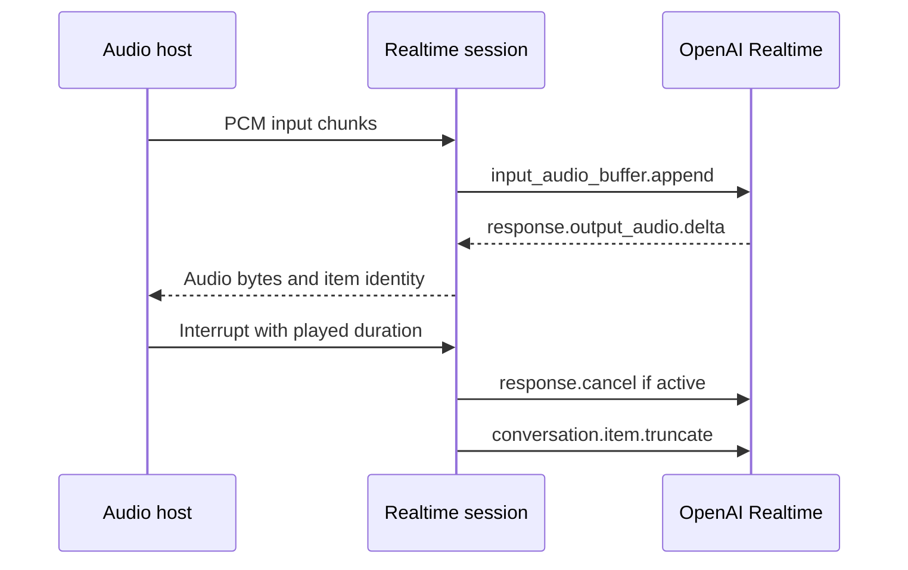

# W18 realtime preview implementation contract

Status: implementation handoff, not a support claim. Sources fetched from official OpenAI documentation on 2026-09-23. The approved report requires an optional session package, one real provider, deterministic fake-session tests, and device audio proof. Missing device access does not justify replacing the session implementation with empty interfaces.

## Protocol boundary

Use OpenAI Realtime as the first adapter. Keep model IDs open; the current documentation examples use `gpt-realtime-2.1`. A session is not a `LanguageModelV4` text call. Its lifecycle, concurrent audio input/output and playback acknowledgments need their own API in optional `ai_sdk_realtime`. Keep microphone, playback and platform permissions out of the pure Dart package.

The shared voice WebSocket documentation also contains GPT-Live examples. These are a different protocol: `/v1/live/sessions`, `session.start`, `session.started`, `session.input_audio.append`, `session.output_audio.delta`, and `session.close`/`session.closed`. Do not mix those events with `/v1/realtime` or advertise GPT-Live support from a Realtime adapter. A second adapter needs its own fixtures and lifecycle audit.

## Required state and events

- Connection state: idle, connecting, ready, closing, closed, failed. WebSocket connection alone is not readiness; wait for `session.created` and configuration acknowledgment where applicable.
- Typed session configuration: explicit audio format/rate, input turn detection (manual/server VAD/semantic VAD), voice, instructions, tool definitions, modality. Initial qualification may constrain formats, but must reject unsupported settings explicitly.
- Typed events for text, output audio bytes, input/output transcripts, speech start/stop, tool request, response terminal state, usage, provider error and opaque unknown event. Preserve response/item/call/content identities.
- Audio bytes come from `response.output_audio.delta`; `response.done` and audio-done do not carry the audio bytes. Do not buffer the whole session to synthesize a final audio result.
- Tool requests preserve the provider `call_id`. Deliver a complete validated call once despite both argument-done and response-done representations. Tool execution belongs to the host; the session submits a `function_call_output` item and explicit response continuation.
- Never auto-replay audio, tool output or response commands after disconnect. Reconnect creates a new session unless a documented provider resumption contract is implemented.

## Client commands and interruption

| Intent | Realtime wire operation |
|---|---|
| Configure session | `session.update`, nested `session.type: realtime`, `audio.input` and `audio.output` |
| Send text | `conversation.item.create`, message with `input_text` |
| Send audio | `input_audio_buffer.append`, base64 raw audio |
| Manual commit | `input_audio_buffer.commit`, followed by explicit `response.create` |
| Clear queued input | `input_audio_buffer.clear` |
| Cancel generation | `response.cancel` |
| Remove unplayed output | `conversation.item.truncate`, item ID, content index, played `audio_end_ms` |
| Submit tool result | `conversation.item.create`, `function_call_output`, exact call ID |

For WebSocket barge-in, the host must stop playback immediately and report the played duration so the session can truncate unplayed audio. Generation cancellation alone does not remove queued playback or fix conversation history. Validate nonnegative playback duration and association with the current output item; discard late output from cancelled responses without discarding unrelated subsequent turns.

## Lifetime and boundedness

Connection/auth startup, readiness and close handshakes need deadlines and cancellation. Cancelling startup must close any late connection. Closing/disposal must terminate subscriptions and owned sockets; no event reaches a disposed host. Preserve the first failure when cleanup throws. Queues, JSON frames and decoded audio frames need explicit byte bounds. A paused or missing consumer must not accumulate unbounded audio. Host buffering/overflow policy must be observable and deterministic.

Use short-lived backend-issued client credentials for public clients. Standard API keys belong on trusted servers. The official guidance prefers WebRTC for browser/mobile audio. A first WebSocket adapter may support Dart servers and controlled native experiments, but cannot claim equivalent mobile audio behavior. Keep the transport seam able to host WebRTC; do not add a mandatory native plugin to core or pretend a fake transport proves device routing.

## Acceptance evidence

1. Real loopback WebSocket protocol tests assert handshake, configuration and emitted JSON, including fragmented network delivery, malformed frames, unknown events and out-of-order identities.
2. Deterministic fake-session tests cover startup cancellation, late connection cleanup, active cancellation, close races, terminal once, duplicate tool events, silent peer timeout and bounded buffering.
3. Transcript/audio/tool/usage fixtures prove IDs and multiple turns, including cancelled, incomplete and failed responses. Unknown usage stays unknown; terminal metadata is not fabricated after disconnect.
4. A compiling host example separates credential acquisition, audio capture/playback, session commands and cleanup. No embedded project key.
5. Device proof remains mandatory for microphone permission denial, background/resume, Bluetooth routing, playback stop/barge-in and echo behavior. Record device/OS/plugin versions, latency and frame data; fake PCM fixtures are protocol evidence only.

## Sources

- [Realtime conversations](https://developers.openai.com/api/docs/guides/realtime-conversations): session configuration, audio events, function calls, interruption/truncation and manual turn flow. Fetched copy: `/tmp/v3-realtime-conversations.md`.
- [Voice WebSockets](https://developers.openai.com/api/docs/guides/voice-websockets?api=realtime): authentication, Realtime endpoint, client transport recommendation, and separate GPT-Live protocol tab. Fetched copy: `/tmp/v3-voice-websockets.md`.

Read the current API schema before implementing event fields absent from the guides. The combined guide contains different API tabs; examples must be attributed to the correct protocol.
