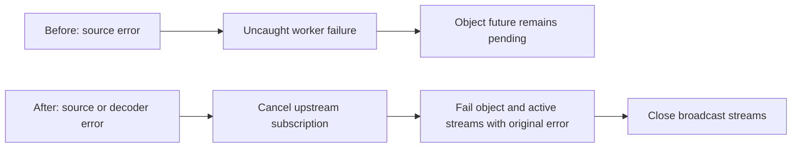
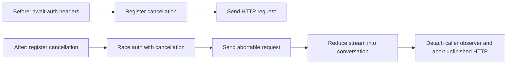

# Reliability implementation evidence

Baseline: `b702929811281ac6be4c5ea2c10004b412b74924`. Work remains in progress; this is not a v3 release certificate.

## Structured-stream settlement

The new public regression failed before the change with the original transport error and a two-second object-future timeout. After the change it passes and observes upstream cancellation. Decoder failure and in-band failure also cancel the source. The final object error remains available through late subscription to `stream`; broadcast partial/raw/text streams close without replaying earlier events.



Final output now requires one complete JSON document, optionally fenced. Repaired partial previews remain available. Multiple complete root documents and truncated JSON fail finalization. Cancellation during the final decoder also prevents success. `stream_object_cleanup_test.dart` reproduces and covers cleanup failures without replacing the original source error. Text-operation deadline integration remains under review.

## Response messages

Both public APIs failed the new history test before the fix: an old assistant turn plus one new answer returned two response messages. Both now return one. Additional two-step tests confirm the new assistant/tool/assistant turns survive model-context compaction.

```text
Before: supplied history + generated turns → filter assistant/tool → duplicate old turns
After:  generated turns → append-only response list
        selected model context → prepareStep → next provider call
```

Tradeoff: callers that worked around the old behavior by slicing response messages must remove that workaround. Newly generated response content remains retained when the model context is compacted; this is required for transcript correctness and is not a memory-reduction claim.

## Embedding integrity and scheduling

A custom provider returning one vector for two inputs previously succeeded; it now fails with a typed error. Extra rows, wrong value association, empty/nonfinite vectors, and mixed dimensions are rejected by core validation. Provider adapters reject response cardinality mismatches instead of truncating extra rows.

A loopback HTTP fixture reproduced OpenAI reversed-row misassociation before the fix. The shared OpenAI/Azure/Mistral parser now reconstructs input order from indices. Duplicate/out-of-range/mixed indexed and unindexed rows fail. Responses with no indices use response order; this fallback remains deliberate for compatible gateways.

```text
101 inputs, concurrency 2:
Before: concurrency also sets batch size → 51 requests, wave scheduling
After:  provider limit 20 → 6 requests, queue scheduling, ≤2 active requests
```

The queue test holds the first request open and proves the third starts through the second worker. Output order remains input order. Provider limits override larger caller batch limits; smaller caller limits are honored. Providers without a verified limit currently expose null, not an invented numerical limit.

Tradeoffs: stricter validation exposes malformed custom providers previously accepted. Default concurrency is one; callers select bounded parallelism explicitly. `maxParallelCalls` no longer determines batch size. OpenAI/Azure declare 2048 inputs and Cohere 96; Google, Mistral and Ollama remain unknown rather than guessing a count. Token and byte limits are separate from those counts. Nontext helpers use the owned cancellation scope; uniform text deadline qualification is incomplete.

## MCP replay

A deterministic transport fixture records a side effect then loses its response. Before the change, a reconnect policy with two retries records three side effects. The default now records one and throws `MCPAmbiguousToolCompletionException`. Applications can explicitly opt into retries per tool call. Legacy session-expiry handling remains distinct because it indicates pre-execution rejection. Closing interrupts backoff and prevents another request.

Tradeoff: applications previously relying on automatic tool retries must classify the operation before opting in. Neither mode provides durable exactly-once execution. The fixture proves client policy; a real loopback disconnect integration fixture is still required for full R7 qualification.

## Remote transport and cancellation

The pinned JavaScript backend validates outgoing Vercel UI messages, including tool/approval history. The parent ran all 9 remote tests with the reference server enabled. Follow-up review found that auth-header acquisition occurred before cancellation registration. The worker moved that acquisition inside the cancellation lifetime, but peer socket closure and subscription cancellation still require independent proof.



The companion adds optional dependencies and a backend deployment requirement for trusted credentials. It does not make a mobile API key secret, and its persistence codec does not execute restored tools.

## Text lifecycle review findings

The first owned-token patch is incomplete. A parent regression run of `text_operation_scope_test.dart` found 3 failures: step expiry did not cancel provider work, first-chunk expiry did not include stream acquisition, and total expiry could race the timer and leave the provider token uncancelled. These failures block W04 qualification. Two happy-path total-timeout tests are insufficient evidence for the full lifecycle contract.

## Commands and current evidence

- `fvm dart test packages/ai_sdk_dart/test`: **620 passed** after W01; before subsequent W02 additions.
- `fvm dart analyze packages`: **passed** after initial embedding changes; rerun required on final diff.
- Focused regression suites were run red before fixes, then green.
- No final full-matrix pass is claimed. Tests run while unrelated owners edit must be rerun after stabilization.
- `AI_SDK_REMOTE_REFERENCE_URL=http://127.0.0.1:8081/chat fvm dart test packages/ai_sdk_remote/test`: **9 passed** before the current lifecycle follow-up.
- `fvm dart test packages/ai_sdk_mcp/test`: **138 passed** before the latest parser correction. A new duplicate-parameter regression failed before correction; all **15 auth-discovery tests passed** afterward.
- Core worker reported **689 passed** before its subsequent text lifecycle patch. That count does not qualify the currently failing text deadline behavior.
- `gh pr list` reconfirmed only draft PR #4. No PR was changed.
- A fresh explicitly selected `gpt-5.6-luna` worker launched successfully and completed review on 2026-09-23. Luna workers now implement the remaining corrections; parent review has rejected incomplete lifecycle and protocol claims.
