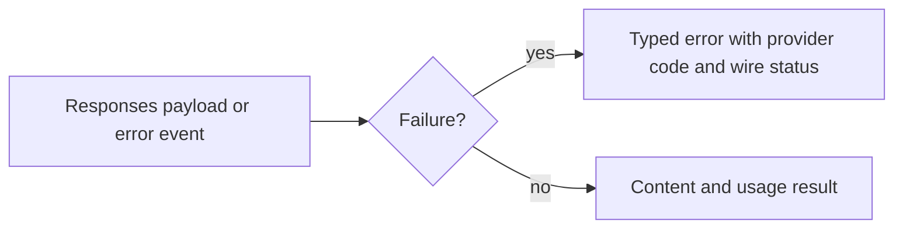

# Remaining Responses error and hosted-tool work

Pinned comparison source: [OpenAI Responses adapter at the approved upstream
revision](https://github.com/vercel/ai/blob/e9c1d2f54da6bd01a16bb8a5fdfcb4b62f34e7d0/packages/openai/src/responses/openai-responses-language-model.ts).
Fetched source: `/tmp/v3-upstream-openai-responses-model.ts`.

## Reproduced structured error loss

`responses_failure_review_test.dart` adds two direct-provider regressions:

1. HTTP 200 with a Responses object whose status is `failed` and whose `error`
   carries `server_error` currently resolves a normal generate result. The
   caller needs a typed failure with the provider message/code.
2. `response.failed` produces an error event, but converts the error object to a
   string and drops its structured code. Callers cannot reliably classify it.

Command:

```sh
fvm dart test packages/ai_sdk_openai/test/responses_failure_review_test.dart
```

Result: 2 failed, `/tmp/v3-responses-failure-before.log`. These are product
failures with loadable fixtures, not test compilation errors. The earlier full
OpenAI 111-pass checkpoint predates these new requirements tests.

The upstream adapter explicitly checks `response.error` before constructing a
successful result. Its error conversion is useful evidence for the boundary,
but do not blindly copy its synthetic status code into Dart: preserve the wire
status separately from response failure classification, and establish retry
policy from provider error semantics. The Dart tests above do not prescribe an
invented HTTP status.

## Hosted tools remain a separate gap

The pinned upstream adapter maps hosted web/file search, code interpreter,
image generation and MCP approval items. It distinguishes provider-executed
calls and their results from host-executed function calls. Current Dart content
types and the Responses adapter do not establish this lifecycle. Adding model
IDs or accepting provider options is insufficient.

Before switching the default endpoint, qualify:

- Host versus provider execution identity; never run a hosted call locally.
- Stable call/item/response IDs across added/delta/done representations.
- Terminal output, preliminary output, errors and approval states.
- Citation/document/file associations and opaque continuation metadata.
- Unknown item preservation and malformed known-item rejection.
- Realistic two-turn fixtures and streaming/nonstreaming equivalence.

Do not substitute fabricated fallback IDs or names for malformed function
calls. Do not claim hosted-tool support from raw event forwarding alone.

Additional parent regression: top-level streaming `type:error` with the string code `rate_limit_exceeded` also loses `AiApiCallError.code`. The expanded parent suite now has **3 failures**, confirmed with `fvm dart test packages/ai_sdk_openai/test/responses_failure_review_test.dart` (`/tmp/v3-responses-error-parent-current.log`). Retain the provider string code separately from HTTP status; a provider error code is not an HTTP status number.

## Correction and parent verification

The adapter now rejects non-streaming Responses objects with `error` or `status:failed` before constructing a result. Both `response.failed` and top-level `error` events use the same structured conversion. Provider message/code/type, actual HTTP status, URL and headers remain available. HTTP 200 stays 200; in-band failure does not grant automatic replay permission. Raw error details remain subject to the existing high-level body policy.

The three originally failing regressions now pass. Full package command `fvm dart test packages/ai_sdk_openai/test` passed **114 tests** (`/tmp/v3-openai-parent-errors-fixed.log`). The hosted-tool and strict-identity gaps above remain open.



Before: a failed generation could resolve normally; stream error codes were lost. After: failure remains machine-readable. The behavior change means callers that previously accepted an empty failed result must handle the typed exception. No new automatic retries are introduced.

## Computer action identity regression after hosted mapping

Pinned upstream `openai-responses-language-model.ts` lines1275–1312 distinguish two computer-call shapes: no `call_id` means provider-executed `computer_use`; a present `call_id` means client-executed `computer` with that call ID and no synthetic result. Current Dart maps both to hosted execution using the item ID. Parent `computer_identity_review_test.dart` reproduces expected`call-action`, actual`item-action` (`/tmp/v3-computer-identity-before.log`). Later assertions also require no synthesized tool result and no provider-executed marker. This is an open W06 correction; the previous worker121-pass count predates it.
