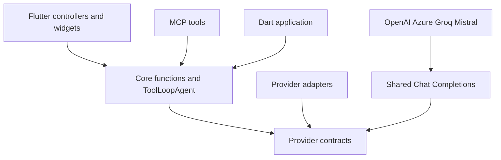
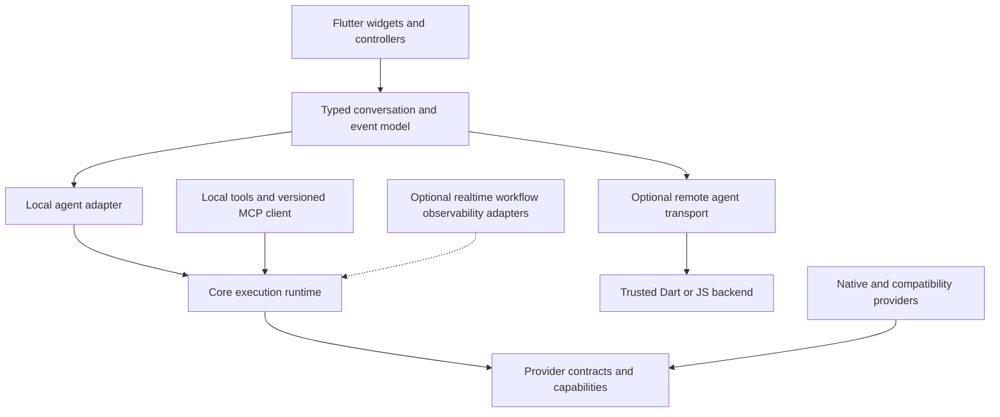

# AI SDK Dart 3.0.0: release research and architecture report

Research date: **23 September 2026, UTC**. Repository baseline: **`b702929811281ac6be4c5ea2c10004b412b74924`**, which matched GitHub `main` during this review. Scope: all 13 libraries, all three examples, current upstream documentation and source, published package metadata, and every open PR returned by GitHub. No implementation changes, commits, PR updates, or provider API calls were made.

## 1. Recommendation

**Make v3 a reliable, modern, Flutter-native AI runtime with explicit Vercel compatibility boundaries.** The highest-value work is modern provider protocols, lossless conversation state, predictable cancellation and tool execution, and a supported connection to trusted backends. More provider names alone will not achieve this.

The upstream target needs updating. The live npm registry reports **`ai@7.0.111`** as stable and **`6.0.288`** on its maintained v6 tag. `@ai-sdk/provider` is **`4.0.17`**. The upstream stable release source is pinned here to **`e9c1d2f54da6bd01a16bb8a5fdfcb4b62f34e7d0`**, the `ai@7.0.111` tag. These are verified releases, not assumptions derived from a future roadmap. [U1–U4]

The Dart repository is already a hybrid: V4 language contracts and grouped usage coexist with v6-style public results and callbacks. Therefore, v3 needs a field-by-field compatibility decision. A version suffix does not prove semantic compatibility.

My recommended stable release promises are:

1. Every generation settles, fails, or cancels predictably, including transport errors and stalled streams.
2. Current OpenAI, Claude, and Gemini workflows work through their required protocols, including multi-turn tools and reasoning metadata.
3. Structured output has explicit validation semantics, with partial data separated from final validated data.
4. Flutter developers can choose direct models or a trusted backend through the same conversation abstraction.
5. Tool approvals, message history, and usage survive serialization without silent data loss or accidental tool replay.
6. MCP supports an explicitly documented modern/legacy version matrix.
7. Performance claims have published measurements, and optional features do not inflate the default dependency graph.

Realtime voice, durable workflows, MCP Apps, harness adapters, and A2A deserve extension points and selected experiments. They should not all become prerequisites for a reliable stable core.

## 2. Confidence, method, and baseline

### What was checked

Three Luna readers reviewed core reliability, provider/model readiness, and Flutter/MCP/framework integration. The parent reviewed the critical cited source, corrected overbroad findings, checked current upstream releases, examined PR #4's actual diff, and reran the reproductions.

The review used primary sources: official provider catalogs, upstream release source, protocol specifications, GitHub PR APIs, and pub.dev/npm metadata. Model information came from visible catalog tables and model cards. Script bundles and stale navigation entries were excluded from the final current-model recommendations.

| Check | Result | Meaning |
|---|---|---|
| `make test` with FVM | **Passed: 1,298 tests** | 12 pure-Dart package groups, the Flutter UI package, and two Flutter example groups passed. The basic CLI is analyzed, but is not a separate test group in this target. |
| `make analyze` with FVM | **Passed: 16 clean analysis results** | All package/example paths enumerated by the target passed. |
| `make format-check` | **Passed: 254 files, zero changes** | Source formatting is clean. |
| Focused core/provider suites | **Passed: 48 tests** | Existing stream-object, generation-parameter, and provider-value tests pass. |
| Added audit reproductions | **Confirmed gaps** | Source-stream error hang, short embedding result, response-history duplication, and decoder-only schema behavior. |
| Existing structured-stream benchmark | **Passed its assertions** | Also exposes substantial cumulative array snapshot copying. |

The verified baseline uses **Flutter 3.44.3 / Dart 3.12.2 through FVM**. The installed system tools are newer, so their presence must not be confused with the pinned release baseline. The manifests declare Dart `^3.11.1`, and the UI package declares Flutter `>=3.41.3`; minimum-version compatibility was not tested here.

Evidence files:

- [Verification record](v3-research/evidence/verification.json)
- [Benchmark output](v3-research/evidence/structured-stream-benchmark.json)
- [Runnable reproductions](v3-research/core_reliability_repro.dart)
- [Open PR snapshot](v3-research/evidence/open-pr-4.json)
- [Official catalog excerpts](v3-research/evidence/official-catalog-excerpts.json)
- [Pinned upstream versions and source hashes](v3-research/evidence/upstream-snapshot.json)
- [Dart ecosystem package snapshot](v3-research/evidence/ecosystem-packages.json)

### What confidence means

- **Reproduced:** the behavior occurred in a local deterministic test during this review.
- **Verified:** source or primary documentation directly establishes the gap or behavior.
- **Proposal:** the recommendation is grounded in a verified need, but the API design remains a choice.
- **Experiment:** value or performance must be established by a prototype or benchmark.

No authenticated current-model smoke tests ran. No iOS/Android device profiling, screen-reader audit, or competitor performance benchmark ran. The 99% coverage gate exists in CI, but coverage was not rerun here. A green baseline does not establish those unmeasured properties.

I am confident in the verified findings and the recommended ordering. I am not claiming that proposed performance improvements, every model endpoint, or every optional platform integration already work.

## 3. Open PR reconciliation and release history

GitHub returned **one open PR**, [#4: Migrate AI SDK Dart to Vercel AI SDK v7 — coordinated 2.0.0 release](https://github.com/codenameakshay/ai_sdk_dart/pull/4).

| Item | Observed state |
|---|---|
| State | Open, draft |
| Last update | 2026-06-29 |
| Head | `688da70c3025127fef146218ea6fa3a98bbb92f8` |
| Recorded base | `6a7cfa1c8a2c852f7f6626ba86ebd9604e672749` |
| Actual implementation | Two commits, six files, 71 additions, two deletions |
| Actual scope | Standard reasoning enum, core forwarding, OpenAI mapping against the old V3 seam |
| Merge state | `CONFLICTING` / `DIRTY` |
| Latest visible check | `analyze-and-test` failed at Analyze; tests did not establish a passing PR baseline |
| Reviews/comments | None returned |

Its broad body includes workflows, harnesses, sandboxing, realtime, MCP Apps, and many bug fixes. **Those plans are not its diff.** Current main already has V4 language types, standardized reasoning, the shared compatibility base, typed errors, cancellation work, MCP HTTP sessions/subscriptions, and repaired approval replay.

The PR's premise that nothing was published is obsolete. pub.dev reports `ai_sdk_dart`, `ai_sdk_provider`, `ai_sdk_openai`, and `ai_sdk_flutter_ui` at **2.0.0**, published on 11 August 2026. Treat public APIs as shipped. [P1–P4]

Recommended disposition:

1. Use this report as a proposed replacement roadmap for v3.
2. Extract any still-useful requirements from #4 into bounded work items.
3. Retire or rewrite #4 through normal maintainer action; do not merge it wholesale.
4. Do not restore its OpenAI `xhigh → high` coercion: current source already forwards `xhigh` directly.
5. Do not retain its automatic transitive dependency proposal for workflow, harness, and sandbox packages. These capabilities have different platform, security, and dependency costs.
6. Recheck open PRs before implementation starts. This is a dated review snapshot, not a lock on future repository state.

No PR was changed by this research.

## 4. Strengths to preserve

The architecture has a sound central boundary. Core depends on provider contracts, not concrete vendors. The shared Chat Completions implementation eliminates four independent parsers. Flutter controllers and widgets are optional. MCP isolates native process support from the web-compatible HTTP surface.

Preserve these implemented features instead of reopening historical audit findings:

- Typed API errors and malformed-response handling.
- Real SSE parsing, including complete event assembly.
- Retryability checks, jitter, `Retry-After`, and cancellation during backoff.
- Language-model cancellation propagated through the major Dio adapters.
- Tool approval replay that retains the pending tool-call identity.
- Anthropic thinking signatures and typed cache-control options.
- Provider option forwarding.
- MCP pagination, mixed resource content, session handling, and resource refresh.
- Flutter request IDs, cancellation, callback containment, and frame-coalesced notifications.
- Structured parsing cadence counters and deterministic offline tests.

Evidence: `retry_helper.dart:55–189`; `tool_loop_agent.dart:110–176`; `anthropic_provider.dart:184–194`; `mcp_client.dart:537–845`; `streaming_controller_base.dart:10–81`; recent commits preceding the baseline merge.

Two documented decisions still matter. [ADR 0002](../docs/adr/0002-v6-parity-scope.md) intentionally omits JS UI transport/framework glue. [ADR 0003](../docs/adr/0003-feature-fates.md) rejects unimplemented video contracts and keeps telemetry dependency-light. New proposals that change these boundaries require replacement ADRs, not claims that the old implementation is accidentally incomplete.

## 5. Verified reliability work

### R1. Settle structured streams after every failure — release blocker

**Reproduced.** `streamObject` starts an unawaited worker with `try/finally`, but no catch around the source stream. A Dart stream error exits that worker before it completes `objectCompleter`. The partial streams close, while the object future remains pending. A throwing `schema.fromJson` reaches the same uncaught path. Evidence: `packages/ai_sdk_dart/lib/src/core/stream_object.dart:109–176`.

Observed output:

```text
unhandled source error: Bad state: transport boom
streamObject object: TIMEOUT (source error did not settle object)
```

Recommendation: one terminal-state owner must settle every exposed future and stream exactly once, preserve the first error and stack, and cancel upstream work. Reuse the well-defined parts of the text-stream terminal machinery. Do not merely suppress the unhandled error.

Acceptance: source `addError`, in-band `StreamPartError`, decoder exception, normal completion, cancellation, and late subscription all terminate consistently. Tests must attach to each public result surface and assert upstream cleanup. Terminal guarantees do not imply replay of earlier broadcast data to late subscribers; document replay separately.

Effort **S–M**; implementation risk **low–medium**. This can be fixed before v3 because users already depend on it.

### R2. Unify cancellation and timeout semantics

**Verified gap.** `streamObject(timeout:)` only times out `model.doStream` startup (`stream_object.dart:88–117`). It has no caller abort token and no deadline while consuming a silent stream. Text generation has richer cancellation and timeout behavior. Embedding, image, speech, transcription, and rerank helpers lack the same explicit abort contract.

Define four separate concepts: connection/startup timeout, idle-stream timeout, total operation deadline, and caller cancellation. A future timeout alone does not establish that HTTP work stopped. Tool timeouts need the same distinction: an arbitrary Dart future cannot forcibly undo or stop an external side effect.

Acceptance: cancel before request, during upload, during stream wait, during retry backoff, during a tool, and during disposal. Verify transport cancellation with a local server, not only early future completion. A total deadline must cover all retries and steps. Cooperative tools receive the token; the docs explain non-cooperative work.

Effort **L across contracts/adapters**; risk **medium**. Design once, migrate each operation with contract tests.

### R3. Reject incomplete or misassociated embedding results

**Reproduced.** A custom model returning one vector for two inputs produces successful `embedMany` output with one entry. Core checks for an entirely empty result but not exact cardinality. Several adapters truncate responses to the shorter list. OpenAI parsing associates rows by array position rather than a validated response index. The short-result success is reproduced; reordered-row corruption remains a fixture case to establish, not a live-provider failure observed here. Evidence: `embed_many.dart:68–100,122–142`; `openai_provider.dart:168–210`; `google_provider.dart:602–633`.

Observed output: `embedMany values=2 returned=1`.

Recommendation: make the invariant explicit: one valid, correctly associated vector per requested value, or a typed failure. Validate indices where the provider returns them, duplicates, missing rows, dimensions, and numeric finiteness. If partial success is useful, expose it as an explicit result type rather than ordinary success.

Acceptance: short/extra/empty arrays, reordered indices, duplicate indices, inconsistent dimensions, and malformed values. Chunked execution must preserve caller order and accurate usage.

Effort **M across adapters**; risk **medium** because stricter checks can expose previously tolerated malformed output.

### R4. Separate embedding batch size from concurrency

**Verified API ambiguity.** `maxParallelCalls` controls both chunk length and concurrent calls (`embed_many.dart:84–122`). With four it uses four values per request and at most four requests in flight; larger inputs create additional waves. Without it, the whole input list goes into one request. This is not an unbounded-concurrency bug; it is a coupled batching/concurrency policy.

Upstream's V4 embedding interface exposes `maxEmbeddingsPerCall` and `supportsParallelCalls`. [U5] Adopt equivalent semantics while retaining a caller override for request-size/token constraints. A count limit alone cannot enforce provider token limits.

Acceptance: 101 inputs with a per-request limit of 20 and concurrency two produce six calls, no call exceeds 20 values, and at most two run concurrently. Include a slow first batch to check scheduling, deterministic output order, cancellation, and partial failure. Use a queue rather than waiting for every request in a wave before starting another.

Effort **M**; risk **medium**. This improves throughput and reliability together.

### R5. Return new response messages, not supplied history

**Reproduced for `generateText`; matching source pattern exists in `streamText`.** The result constructs response messages by filtering the complete normalized history for assistant/tool roles (`generate_text.dart:634–640`; `stream_text.dart:739–745`). Supplied assistant history is therefore included. A caller that appends the returned messages can duplicate prior turns.

Recommendation: track generated messages separately from model input/context. Context compaction must not rewrite the user's persisted transcript. For v7 semantics, step responses contain only that step's messages; the top-level response list contains newly produced messages across the call, including approval replay where applicable. [U4]

Acceptance: provide prior assistant and tool messages, generate two new steps, and append the result. No old message duplicates. Repeat after `prepareStep` compaction and paused approval replay.

Effort **M**; risk **medium** because some callers may have compensated for existing behavior.

### R6. Define runtime schema validation honestly

**Reproduced behavior, not an allegation that arbitrary decoders are invalid.** `Schema<T>` contains JSON Schema and `fromJson`; the decoder determines local acceptance (`tools/tool.dart:98–103`). An identity decoder accepted `{unexpected: 1}` despite a schema requiring `city`. Provider strict mode does not replace local validation of tool inputs or final output.

Recommendation: distinguish a schema sent to the model, a runtime validator, and a Dart decoder. Provide a small validation interface with structured path-aware errors; optionally integrate a vetted JSON Schema implementation or generated serializers. Declare supported schema dialect/features. Do not silently claim all JSON Schema is implemented.

Partial output must permit incomplete fields without masquerading as a valid final `T`. Consider a distinct partial snapshot value and final validated object. Preserve the low-friction map use case with an explicitly decoder-only mode.

Acceptance: required fields, scalar types, nested objects, arrays, enum/choice, nullable values, and additional properties; invalid tools do not run; incomplete snapshots do not crash the stream; final invalid output fails with a typed error. Code generation remains optional.

Effort **L**; risk **medium–high** because validation can change behavior for existing users.

### R7. Make MCP replay policy operation-aware

**Verified source behavior; duplicate external side effects were not exercised.** With `MCPReconnectPolicy`, `_send` catches failures and retries the same request without classifying its method (`mcp_client.dart:495–530`). `callTool` uses that path. A tool can finish remotely while its response is lost; blind replay can run it twice. This differs from a server explicitly rejecting an expired legacy session before execution.

Recommendation: distinguish safe discovery/read retries, confirmed pre-execution rejection, ambiguous tool completion, and application-authorized retry. A JSON-RPC ID alone is not a server idempotency guarantee. Return a typed ambiguous-completion error when necessary. Modern MCP's new-request-ID requirement does not make business side effects idempotent.

Acceptance: a fake server records a side effect and disconnects before the response. Default client behavior does not silently repeat it. Explicit idempotent tools may retry under an application policy. Test concurrent refresh/reconnect, close during backoff, and cancellation.

Effort **M–L**; risk **high** at the behavior boundary.

### R8. Minimize retained payloads and captured telemetry

**Verified design gap.** Results retain provider bodies by default (`generate_text.dart:641–650`). Enabling telemetry with a recorder sends the prompt as an initial attribute (`generate_text.dart:380–387`; `stream_text.dart:89–96`). There is no separate content-capture toggle in `TelemetrySettings`. Retention and tracing are separate: this does not mean raw bodies are automatically sent to telemetry.

Adopt opt-in request/response body retention, matching v7's memory-conscious default. [U4] Add distinct flags for prompt/output capture and redaction callbacks; keep metrics and model identifiers useful without content. Make recorder failures unable to replace successful generation results, with an explicit diagnostic channel.

Acceptance: with defaults, no prompt, binary attachment, authorization value, or tool secret appears in recorded attributes or retained raw bodies. Opt-in capture works with truncation and redaction. A throwing recorder has deterministic behavior. Measure retained memory before claiming an improvement.

Effort **M**; risk **medium** for callers that read bodies today.

## 6. Vercel v6 baseline and stable v7 alignment

The goal should be **documented behavioral alignment**, not a blanket “100% parity” badge. Publish a matrix with separate statuses: implemented, partially implemented, Dart adaptation, intentionally omitted, and experimental.

| Surface | Current Dart state | Recommended v3 contract | Priority |
|---|---|---|---|
| Language model interface | V4 options, usage, tools, abort signal exist | Compare every field/event with pinned upstream V4; document deliberate Dart differences | Required |
| Other model interfaces | Embedding V2, Image V3, Speech/Transcription/Rerank V1 | Audit current upstream V4 contracts; migrate semantics that matter, with a rename map for custom providers | Required design |
| Top-level instruction | `system`; agent uses `instructions` | Prefer `instructions`, with a deliberate shipped-API migration policy | Required |
| System-role messages | Accepted in core message shapes | Choose v7 default rejection/explicit opt-in; never silently convert privileged instructions to user content | Required |
| `prepareStep` | Model/tools/messages/options, no instruction override | Add instruction override and test carry-forward rules for instructions and compacted messages | Required |
| Result usage | Last step in `usage`, sum in `totalUsage` | All steps in `usage`; explicit `finalStep.usage` | Required, breaking |
| Result content/tools/sources | Largely final-step views | All-step collections with a complete `finalStep` view | Required, breaking |
| Response messages | Filtered conversation history | New response messages only; each step retains its own messages | Required |
| Callbacks | `onFinish`, `onStepFinish`, experimental lifecycle names | Consistent `onEnd`, `onStepEnd`, stable start/execution events; migration map | Required |
| Full stream | `fullStream`, separate chunk callback taxonomy | Prefer `stream`; one exhaustive event model, with documented all-part callback behavior | Required design |
| Raw/body inclusion | `includeRawChunks`; raw bodies retained | One inclusion policy; content-heavy bodies off by default | Required |
| Tool approval | Policy attached to `Tool`; resume exists | Request/agent-level policy, separate from reusable tool implementation; preserve correct replay behavior | Required design |
| Context | Shared `runtimeContext` reaches tools | Separate generation context and typed per-tool context; secrets stay outside prompts | Required |
| File inputs | Bytes/base64/URL; separate image part | Canonical media/file model plus opaque provider references; lossless reasoning-file handling | Required |
| Provider-hosted tools | Generic declarations and partial wire passthrough | Typed factories and complete event/result semantics for the selected hosted tools | Required for flagship providers |
| Embedding limits | No provider limit contract | Independent size/concurrency, provider capabilities, cancellation | Required |
| Telemetry | Bring-your-own recorder | Preserve lightweight seam; optional OTel exporter and standard event attributes | Recommended |
| Files and skills | No common upload/reference lifecycle | Files first for large reusable inputs; skills as optional provider feature | Staged |
| Batch | No common job lifecycle | Optional experimental job API with one concrete provider | Staged |
| Realtime | No session abstraction | Separate experimental session API, not a text-stream flag | Staged |
| Evaluation | No specialized evaluation API | SDK behavior/quality eval harness first; upstream experimental evaluation adapter later | Staged |

The upstream migration guide establishes instruction/callback renames, aggregate results, `finalStep`, context separation, canonical files, and body inclusion changes. [U4] Its deprecation aliases are migration aids, not a requirement to reproduce every JS alias permanently in Dart.

Keep package versioning separate from provider-contract versioning. Dart v3.0.0 does not imply a `LanguageModelV5`. Likewise, renaming an embedding type to V4 without adding the corresponding behavior would mislead provider authors.

## 7. Current model readiness

### Model support must mean more than accepting a string

Every provider factory accepts a `String modelId`. That is useful for newly released or private deployments. It does not prove that the adapter understands the model's endpoint, tools, reasoning state, media formats, or usage.

Publish capability status per **provider + model + API surface + feature**. Suggested levels:

- **Catalog-listed:** current official documentation names the model.
- **Fixture-tested:** adapter request/response and multi-turn fixtures cover the feature.
- **Live-smoke-tested:** a dated authenticated test succeeds on the named API surface.
- **Preview:** provider or SDK contract remains experimental.

The entries below are catalog evidence, **not live-smoke-tested claims**.

| Provider | Current catalog targets observed | SDK implications |
|---|---|---|
| OpenAI | `gpt-6-astra`, `gpt-6-sol`, `gpt-6-luna`; `gpt-realtime-2.1`; `gpt-image-2.5-sunburst`; `gpt-transcribe` | Current catalog places modern workflows on Responses. Add that adapter; separate realtime from text calls; verify current media formats. Catalog reasoning includes `max`, beyond the portable enum's `xhigh`. |
| Anthropic | `claude-opus-5-5`, `claude-fable-5-1`, `claude-sonnet-5`, `claude-haiku-4-5-20251001` | Current overview distinguishes adaptive/always-on thinking from older enabled/disabled budget thinking. Update typed options and multi-turn fixtures; retain existing signature/cache support. |
| Google | Stable `gemini-3.8-flash`, `gemini-3.8-live`, `gemini-3.8-live-extended-thinking`; `gemini-embedding-001`; preview `gemini-embedding-2-preview`; `gemini-3.5-transcribe` | Preserve thought signatures and thought flags; implement native structured-output mapping; add Live only through a session API. Multimodal embeddings need more than string values. |
| Groq | Production table includes `openai/gpt-oss-120b` and `openai/gpt-oss-20b` | Validate reasoning and tool payloads per model. Do not infer vision support from compatibility-base defaults. |
| Mistral | Featured GA Medium 3.5 card gives API ID `mistral-medium-3-5` | Test native reasoning and schema options; OCR/audio/batch need explicit APIs. Retired Medium 2505/2508 IDs are not current recommendations. |
| Cohere | Live `command-a-plus-05-2026`; `command-a-03-2025`; `embed-v4.0` | Cover reasoning/vision and rerank semantics. Embed v4 supports multimodal inputs that the current text-only embedding adapter cannot express. |
| Azure | Deployment names and availability depend on region/resource/API surface | Do not manufacture one universal “latest Azure model ID.” Add deployment capability descriptors and verify Responses/auth support against Azure's current API. |
| Ollama | Installed model tags vary by local server | Query optional local capabilities; test representative tool/vision/reasoning models. Keep arbitrary local tags supported. |

Sources: [M1–M9]. Current pages can contain deprecated models and previews alongside stable models. Update this table during release qualification; do not turn it into a permanent allowlist.

### OpenAI: highest-value protocol work

`OpenAIProvider.call` currently returns `OpenAICompatibleChatLanguageModel` (`openai_provider.dart:53–67`). That implementation posts Chat Completions. Add a **separate Responses adapter implementing the existing language-model contract**, while retaining explicit Chat Completions access. A new core model category is not needed merely because the endpoint changes.

Required work:

1. Responses request/input-item conversion and streaming event parser.
2. Item IDs, tool-call IDs, provider execution status, opaque reasoning data, and continuation metadata.
3. Text, structured output, refusal/incomplete results, files, usage, and terminal errors.
4. Typed provider-hosted tools, starting with web/file search where documented and tested.
5. A choice between stateless client-managed history and provider-managed continuation. Define storage/retention behavior explicitly.
6. Typed provider-specific reasoning options. Do not silently coerce a new level such as `max` to an older portable level.
7. Background response retrieval/cancellation and file management only after basic Responses works.

Changing `openai(id)` to default to Responses is a reasonable v3 proposal, but requires a migration note and explicit `chat(id)` escape hatch. Test custom gateways that only implement Chat Completions before making that decision.

### Anthropic: modern thinking and hosted tools

The adapter already retains non-streaming thinking signatures and supports cache control. Its typed `AnthropicThinkingOptions` emits only `enabled`/`disabled`, and `speed: 'fast'` disables thinking (`anthropic_options.dart:18–58`). That is not an adequate model of current adaptive/always-on thinking.

Add model-aware typed thinking/effort options with provider-specific precedence. Verify stream signature assembly and replay, including redacted content. Do not discard opaque reasoning data merely because the UI does not display it.

Generic provider tool declarations already serialize through `_toAnthropicTool`; this is useful partial support. The remaining work is tested typed factories, hosted tool call/result lifecycles, citations, pause/continuation semantics, and native structured output where the official endpoint supports it. Distinguish client-executed computer-use functions from provider-executed search/code tools.

### Google: preserve the reasoning conversation

`google_provider.dart:170–187` converts all text to ordinary text parts and builds function-call parts without preserving `thoughtSignature`. `_toGoogleContents:703–730` reconstructs calls without that metadata. Current Gemini reasoning/tool protocols require careful preservation across turns. [M3]

Treat this as a priority compatibility gap: preserve thought flags/signatures, tool identifiers where supplied, and exact replay semantics. Test multi-turn tool calls against official fixtures and live models before claiming current Gemini compatibility.

The request's `generationConfig` also does not map the shared response-format schema (`google_provider.dart:100–113`). Raw provider options provide an escape hatch, but the portable structured-output API should invoke native constrained output where supported. Grounding/search declarations already pass through provider-defined tools; improve their typed wrappers and returned grounding metadata rather than claiming no support exists.

### The other adapters

- **Azure:** add the selected modern OpenAI API surface with Azure-specific authentication and deployment tests. API-key support is not equivalent to complete identity/token lifecycle support.
- **Groq:** keep the thin adapter, but test capability flags and stream usage against current model families. Audio and batch are separate optional extensions.
- **Mistral:** preserve shared Chat Completions reuse; add typed native controls. OCR has concrete document-app value, but requires a dedicated result model and fixtures.
- **Cohere:** validate specific-tool choice behavior rather than silently equating a named tool with generic required-tool selection. Add multimodal embedding input design and current reasoning/vision fixtures.
- **Ollama:** map portable response format to native `format` and schema. Its absence does not mean core JSON parsing is absent. Consider typed `think`, `keep_alive`, and model capability discovery after verifying current server contracts.
- **OpenAI-compatible base:** provide an ergonomic custom-provider factory and explicit capability overrides. Preserve unknown provider metadata. Do not force Responses, native Anthropic, or Gemini protocols through this module.

For image/audio adapters, add fixtures for non-default MIME types, URL versus inline results, empty output, streaming where supported, and cancellation. OpenAI image parsing currently labels decoded images `image/png` (`openai_provider.dart:279–285`); validate the requested/returned format before promising JPEG/WebP options.

### Model catalog and update policy

Keep arbitrary IDs valid. Offer advisory descriptors containing endpoint family, input/output modalities, tools, native schema, reasoning controls, limits, preview/deprecation state, and source/date. Azure deployment overrides and private gateway models must remain possible.

Generate model helpers from reviewed catalog snapshots, not hand-maintained exhaustive enums. A scheduled source check can propose updates; it must not silently change production defaults. A source compatibility check and dated live smoke test promote a capability to supported status.

## 8. Proposed architecture

### Current structure



### Proposed v3 structure



Keep the distinction between three message layers:

1. **UI conversation:** stable IDs, lifecycle, parts, attachments, approval state, metadata, and persistence version.
2. **Model input:** normalized messages selected for the next call, possibly compacted.
3. **Provider wire format:** vendor-specific JSON, opaque signatures, and references.

Collapsing these layers makes persistence, context compaction, and remote transport harder. Keeping them explicit allows a user-visible transcript to remain complete while model context is trimmed.

### Core execution runtime

Extract shared request normalization, step accounting, approval evaluation, tool execution, and terminal settlement where duplication demonstrably causes drift. Keep stream-specific event processing explicit. Avoid a universal callback engine that obscures control flow.

A useful target is an immutable per-step result and an append-only call ledger. It can derive aggregate usage/content and `finalStep` consistently for generation and streaming. Characterization tests must precede extraction.

### Tool context and approvals

Reusable tools define schemas and execution. A request/agent provides approval policy, typed tool context, and concurrency policy. Shared runtime context supports orchestration; it should not automatically expose every secret to every tool.

Persisted/remote approvals need binding to the exact call ID, arguments, user/session, and policy version. A UI approval is not server authorization. Server-side authorization must run again at execution. Cryptographic approval tokens are an optional backend mechanism, not a secret embedded in Flutter.

### Conversation and persistence

Provide codecs and a storage interface, not a bundled database. Define stable message/part IDs, schema version, unknown-part preservation, interrupted-turn state, and migrations. Binary files should normally be references, not duplicated base64 inside every persisted snapshot.

Test restart during a pending tool approval, a streamed reply, and a failed remote call. Do not claim exactly-once execution across process death without a backend idempotency and transaction design.

### Typed configuration and extension stability

The core functions have many named options. Keep short calls easy, but allow reusable typed options for model settings, request policy, tools, and inclusion/telemetry. Avoid a single untyped settings map. Preserve an explicit provider-options escape hatch for new vendor features.

Before adding packages, record the dependency graph, supported platforms, and owner. Keep realtime, framework adapters, OTel exporters, A2A, workflow stores, and process harnesses opt-in. A lightweight public interface does not require every implementation to be a transitive dependency.

## 9. Flutter production use and framework integration

### A supported trusted-backend path

The current UI expects a `ToolLoopAgent`. Production applications often execute model calls and privileged tools on a backend. A supported remote-agent adapter should let the same widgets consume that backend's typed events.

A companion package for Vercel UI-message streams is a high-value v3 proposal. This deliberately revisits ADR 0002. It does not require porting React, RSC, or Next.js into Dart. Pin the supported wire protocol and test against a small real reference server built with the selected `ai` version. [F1]

The adapter needs text/reasoning boundaries, tool input/result/approval states, sources, files, metadata, errors, cancellation, and auth hooks. HTTP/SSE alone does not imply resumption; recovery requires an explicit server contract and stable IDs.

Acceptance: equivalent local and remote fixtures produce equivalent conversation state. No missing tool parts, no duplicated turns after retry, and no provider key in the distributed client. Include backend examples in both a minimal Dart HTTP service and a Vercel AI SDK route, with clear ownership of authorization.

### State management

Keep `ChangeNotifier` support. Add tested Riverpod and Bloc recipes before publishing new adapter packages. Current pub.dev versions observed were `flutter_riverpod` **3.4.3** and `flutter_bloc` **9.1.1**. [F4] This is a compatibility target, not a reason to force those dependencies into every app.

Recipes should demonstrate disposal, cancellation on route/provider removal, separate content/status listeners, application-owned persistence, and replacement of a provider/agent without stale events. Promote repeated stable glue into optional adapters only after the recipes reveal the necessary API.

### Rendering and accessibility

`ChatMessageList` listens to the controller and rebuilds its list shell (`chat_message_list.dart:148–198`). It already uses lazy list construction and coalesced notifications. Therefore, poor frame performance is a hypothesis to profile, not an established bug.

Profile 10, 100, and 1,000-message histories at multiple event rates. Compare full-controller rebuilds with per-message/per-part updates. Preserve scroll anchoring when the user reads old messages, selects text, or approves a tool. Coalesce UI notifications without dropping semantic events.

Retain the product's theme slots and callback-based attachments/links. Improve internationalization of built-in labels, keyboard/IME behavior, RTL, large text, reduced motion, focus restoration, and screen-reader announcements. Avoid announcing every token. Accessibility compliance requires device/browser checks; widget semantics tests alone do not prove WCAG conformance. [F2–F3]

### Platform matrix

Declare capabilities individually for Dart VM, Flutter web, Android, iOS, and desktop. Distinguish “compiles” from “feature supported.” Examples: stdio tools are desktop/CLI-oriented; mobile microphone permission and audio interruptions require platform code; browser CORS is not solved by the SDK.

Add minimum-supported and pinned-current toolchain lanes, plus a latest-stable compatibility lane. The presence of a newer installed Flutter SDK is not evidence that every platform/plugin combination works.

## 10. MCP modernization

This is a major protocol project, not a version-label update.

The official latest URL resolved to **`2026-07-28`** during this review. The package explicitly sends **`2025-06-18`** and only accepts that version in the initialize response (`mcp_client.dart:413–441`). It targets that legacy version; this report does not certify full legacy conformance. [C1–C3]

| Concern | Existing implementation | Current specification direction |
|---|---|---|
| Initialization | `initialize` and initialized notification | Stateless per-request version/capability metadata |
| Discovery | Handshake response | `server/discover` with supported versions/capabilities |
| HTTP state | `Mcp-Session-Id` | Protocol-level sessions removed |
| Server push | GET SSE and resource subscription methods | `subscriptions/listen` over POST response stream |
| Resume | `Last-Event-ID` | SSE message redelivery/resumability removed |
| Routing metadata | Legacy protocol/session headers | Required `Mcp-Method`/`Mcp-Name` where applicable |
| Result shape | Legacy result objects | `resultType`, including input-required rounds |
| Client interaction | No general modern MRTR flow | Multi Round-Trip Requests with explicit input requests/responses |
| Long-running work | One-shot call and notifications | Official Tasks extension, separate from core progress |
| Cache hints | No typed cache-result contract | `ttlMs` and `cacheScope` on cacheable results |

There is also a verified legacy negotiation defect: the initialize request advertises `tools`, `prompts`, and `resources.subscribe` as client capabilities (`mcp_client.dart:414–418`). The legacy specification assigns those to servers; client capabilities include roots, sampling, elicitation, and experimental extensions. Send only capabilities the client actually implements and test the client/server distinction. This is a small, independent correctness fix; strict-server rejection was not exercised. [C7]

Recommended v3 approach: explicit versioned protocol strategies behind the existing client-facing tool/resource abstractions. Support modern stateless behavior and a documented legacy mode. Discovery/downgrade must happen before side-effecting calls, not after a failed tool is ambiguously retried.

Do not promise arbitrary live tool-output chunks because progress notifications exist. Progress, task handles, intermediate interaction, and final tool results are distinct concepts. Add typed progress first, then selected Tasks/MRTR support with conformance tests. [C4]

Authorization needs current protected-resource/authorization-server discovery, issuer/resource binding, PKCE where applicable, token refresh hooks, and safe redirect handling. The new specification deprecates Dynamic Client Registration in favor of Client ID Metadata Documents; do not build an exclusively old-flow OAuth layer. Leave token storage to host applications. [C2]

Security and correctness checks must cover request/header consistency, credential redaction, issuer changes, bounded schema/reference processing, private versus public cache scope, and replay policy. Current MCP response buffering already has limits; preserve them instead of claiming all buffering is unbounded.

**MCP Apps is a separate optional host feature.** Its official extension uses `ui://` resources, sandboxed HTML/iframes, permissions/CSP, and an App Bridge. [C5] Flutter integration needs a WebView/iframe boundary and platform-specific policy. Do not render arbitrary server HTML as trusted native widgets or make a WebView a default UI dependency.

## 11. Performance program

### What is measured now

The existing benchmark feeds structured JSON one character at a time. Its array branch takes a full immutable snapshot on each new element.

| Nominal payload | Elements | Parse attempts | Snapshot elements copied | Parent run elapsed |
|---|---:|---:|---:|---:|
| 1 KiB array | 4 | 4 | 10 | 5.36 ms |
| 64 KiB array | 244 | 244 | 29,890 | 34.38 ms |
| 1 MiB array | 3,874 | 3,874 | 7,505,875 | 174.85 ms |

These are single local Dart VM samples, not Flutter frame times or provider latency. Parse counts are bounded by elements. Cumulative snapshot copies follow `n(n+1)/2`; this is quadratic copy work, not proof of quadratic peak retained memory. The benchmark's `_assertLinear` explicitly allows that copy count (`structured_stream_benchmark.dart:104–142`).

Recommendation: preserve `elementStream` as the efficient incremental path; avoid full-array snapshots when nobody consumes them; offer snapshot cadence/batching with documented semantics. Measure before selecting persistent collections or isolates. An isolate can add transfer cost and does not automatically solve allocation pressure.

### Performance work ranked by expected value

| Work | Why it matters | Proof required |
|---|---|---|
| Embedding size/concurrency separation | Prevent oversize requests and keep network capacity occupied | Controlled latency/limit fake model; provider rate-limit fixtures |
| Optional bounded tool concurrency | Independent I/O tools currently run serially | Ordering, approval, cancellation, and side-effect tests; serial vs bounded benchmark |
| Incremental structured output | Reduce cumulative snapshot copying | Existing benchmark plus listener/no-listener and large-element variants |
| Opt-in raw body retention | Avoid retaining repeated prompts/media | Heap/allocation measurements across multi-step calls |
| Streaming UI row isolation | Keep long histories responsive | Profile-mode traces on declared reference devices |
| Prompt/context management | Lower input cost and first-token latency | Token/usage measurements, compaction correctness, cache-read metrics |
| Stream fan-out policy | Define slow, paused, late, or absent subscribers | Memory and completion tests; no assumed universal backpressure |

Tool concurrency should be **explicit and bounded**, initially preserving serial behavior unless opted in. Preserve deterministic result ordering even when execution finishes out of order. Independent execution cannot be inferred safely from tool names.

### Proposed release benchmark contract

Record SDK overhead separately from network/model time: request serialization, first byte to first SDK event, first event to UI frame, processing per chunk, allocations, peak memory, cancellation latency, and final parse time. Track p50/p95/p99 where enough samples exist.

Use a fixed reference machine/device, warm-up, at least 30 repeated desktop runs for stable distributions, and versioned fixtures. Add CI regression tolerances based on observed variance. A tentative 10% median regression alert is a starting policy to calibrate, not a validated threshold.

For 60 Hz UI, budget against the 16.7 ms frame interval and publish build/raster distributions. For 120 Hz, repeat against 8.3 ms. Do not publish “zero dropped frames” or “fastest Dart SDK” without a defined workload and comparative evidence.

## 12. New providers, architectures, and frameworks

### Provider expansion

Prioritize adapters by user value and ongoing maintenance, not provider count.

1. **Custom OpenAI-compatible endpoints:** an ergonomic factory provides immediate reach for local servers and hosted compatible services. Publish tested limits.
2. **OpenRouter, DeepSeek, xAI:** candidate adapters after their current native/compatible protocol requirements are verified. Upstream xAI now defaults to Responses, so a Chat-only wrapper is not complete parity. [U4]
3. **Vertex AI and AWS Bedrock:** enterprise priorities if cloud identity, regional routing, and compliance needs exist. They require native auth/protocol work, not a changed base URL.
4. **Firebase AI Logic:** evaluate an optional provider integration for Flutter's managed client path. It is a different integration model from direct Gemini API keys.

Each new adapter must have a named maintainer, capability table, auth lifecycle, malformed/error fixtures, cancellation behavior, and at least one dated live smoke test before a verified-support claim. No adapter enters stable merely because one text prompt works.

### Realtime voice

Upstream realtime is explicitly experimental. [U6] Design a session API with connection state, turn detection, audio formats, interruption/barge-in, tool requests, transcripts, usage, reconnection, and cancellation. Keep microphone/playback adapters outside the pure Dart core. Use short-lived client credentials issued by a trusted backend.

Start with one provider and a deterministic fake session. Expand to another provider only after the session abstraction survives different event semantics. Flutter audio lifecycle, backgrounding, Bluetooth routing, and echo cancellation need device testing. TTS followed by STT is not equivalent to a realtime conversation protocol.

### Durable workflows and harnesses

Upstream `WorkflowAgent` runs in a durable workflow runtime; its persistence and resumption are architectural properties. [U7] A Dart implementation needs checkpoint schema, lease/concurrency ownership, tool idempotency, approval persistence, versioned replay, and crash-recovery tests. An in-memory store is useful for tests but is not durable.

Upstream harness integrations wrap external coding-agent runtimes. [U8] They fit desktop/server extensions better than a universal mobile dependency. Provide a separate agent/session adapter when demand justifies it. A local `Process` runner or Dart isolate is **not a security sandbox**. Do not reuse the term sandbox without enforced filesystem/network/resource isolation.

### A2A and other agent frameworks

The official A2A release API reports **v1.0.1**, published 28 May 2026. [C6] A2A models remote agents, tasks, messages, artifacts, and discovery; MCP models tools/context. Neither automatically implements the other.

Build a remote-agent/event abstraction that can host an optional A2A adapter. Do not import every agent framework into core. Python/JS workflow frameworks generally belong behind a remote service boundary from Flutter. Test interoperability against named versions rather than claiming general framework compatibility.

### Batch, files, skills, video, and evaluation

- **Files:** highest immediate value for large documents and reusable provider references. Include upload/get/delete lifecycle, ownership, MIME handling, cancellation, and cleanup policy. [U9]
- **Batch:** cost/throughput feature for offline workloads. Upstream remains experimental. Use typed job states and per-item failures; one real provider first. [U10]
- **Skills:** optional provider upload/reference support, not a requirement to execute arbitrary local instructions. [U11]
- **Video:** revisit ADR 0003 only with a concrete provider, polling/cancellation model, result storage, and tests. Do not add empty interfaces for brochure parity.
- **Evaluation:** build SDK correctness and model-task evals first. Upstream's specialized evaluation API is experimental; support it only with a useful adapter and clear probability/confidence semantics. [U12]

### Competitive position

pub.dev currently lists `langchain` 0.9.0, `firebase_ai` 4.0.0, `dart_openai` 8.0.0, and `openai_dart` 9.0.0. The two OpenAI clients advertise Responses/realtime coverage in their package descriptions. This is published metadata, not a source-level competitive audit. [F4]

The opportunity is a combination: provider-neutral workflows, reliable typed streams, and polished Flutter integration. Do not attempt to win by implementing every cloud administration endpoint or every retrieval database. Integrate with existing application/storage stacks through clear interfaces and examples.

## 13. Developer experience and operating reliability

### Make the correct first application easy

Provide two equally prominent quickstarts: local development with an explicit provider instance, and production Flutter through a trusted backend. Existing runtime credential callbacks are a strength. Do not misreport compile-time convenience factories as the only authentication option.

Offer examples for streaming chat, typed output, tool approval, cancellation, image/document input, embeddings/rerank, and remote execution. Compile documented snippets in CI. Make models configurable; pin a dated tested example model without forcing it as a permanent global default.

Errors should answer: what failed, whether it is retryable, whether any tool side effect may have occurred, and what context is safe to log. Preserve provider request IDs and HTTP status while redacting credentials. Distinguish user cancellation from timeout and transport failure.

### Observability

Keep the current recorder interface lightweight. Add a stable event vocabulary for model/step/tool spans, first-token latency, retry count, queue time, cancellation reason, token usage, and cache usage. Unknown usage remains unknown; do not turn it into zero in reports or billing estimates.

An optional OTel bridge is consistent with both the existing ADR and upstream's separate OTel package. Cost estimation must use dated external price metadata and be labeled an estimate. A model catalog should not silently become a billing authority.

### Resilience policy

Preserve the existing retry engine. Add characterization around partial-stream failures and provider-side work: automatic fallback after emitted content or tool execution is not equivalent to retrying a request that never started. A fallback/routing middleware should only switch at defined safe boundaries.

Offer budgets for steps, tool calls, output tokens, elapsed time, and optionally application-estimated cost. Context compaction should be configurable via `prepareStep`, retain required tool pairs and signatures, and leave the persisted transcript intact.

### Documentation and version policy

Replace the mixed v6 parity narrative with a versioned compatibility matrix and migration guide. State the exact upstream versions reviewed. Each capability claim links to a test group and protocol/source reference.

Document callback exception semantics, broadcast stream subscription timing, disposal ownership, partial output, retry/replay behavior, and platform limits. The same words must have the same meaning across packages.

## 14. Verification and release gates

The existing 99% line-coverage gate is useful, but the reproduced hang demonstrates why behavior coverage matters more than the percentage alone.

| Layer | Required additions | Release proof |
|---|---|---|
| Core | Terminal-state matrix, complete result accounting, context/approval semantics, schema validation | Deterministic model fakes and assertion-rich tests |
| Streaming | UTF-8 fragmentation, multi-line SSE, CRLF, truncated events, source errors, paused/late listeners, huge chunks | Fuzz/property-based chunk partitioning with reproducible seeds |
| Provider wire | Current model fixtures, native hosted tools, reasoning signatures, malformed 2xx, usage, cancellation | Sanitized golden request/event fixtures plus semantic assertions |
| Upstream alignment | Equivalent scenarios against pinned JS and Dart SDKs | Differential results after intentional differences are normalized |
| HTTP/MCP | Version negotiation, auth refresh, redirects, disconnects, ambiguous tool completion | Local protocol servers; modern and legacy suites |
| Flutter | Restart/restore, remote transport, approval, long history, IME/focus, reduced motion | Widget tests plus fixture-driven integration tests |
| Platforms | VM, web, Android/iOS, desktop feature boundaries | Build/smoke matrix; profile/accessibility runs where required |
| Live providers | Selected current text/reasoning/tool/schema/media models | Opt-in scheduled canaries with spend limits and dated reports |
| Packaging | Minimum SDK, public API docs, example constraints, publish order | Dry-run every package; compiled migration examples |

Live checks must use controlled credentials, benign prompts, explicit spend limits, and no customer data. PR CI should remain deterministic and key-free. A provider outage should not make all code changes fail nondeterministically.

Use the existing commands as the baseline:

```sh
make test
make analyze
make format-check
make benchmark
make coverage-check
make dry-run
```

Only the first three and the existing benchmark were run in this research. The remaining commands are release gates to run during implementation/qualification.

## 15. Sequenced delivery plan

Effort estimates include implementation, tests, and docs, but are planning ranges rather than commitments: **S = up to a few days; M = roughly one engineer-week; L = multiple engineer-weeks; XL = a separate project.** Prototype high-risk interfaces before committing to a schedule.

| ID | Work package | Priority | Effort / change risk | Dependencies and acceptance |
|---|---|---|---|---|
| W01 | Stream settlement and response-message correctness | P0 | M / medium | Existing repros become regression tests; all result surfaces terminate; no history duplication |
| W02 | Embedding integrity and batching | P0 | M / medium | Exact cardinality/order; separate size/concurrency; provider limits and cancellation |
| W03 | v3 contract and migration decisions | P0 design | L / high | Written result/event/file/context schema, Vercel mapping, and public API migration examples |
| W04 | Uniform request lifecycle and schema validation | P0/P1 | L / high | W03; every operation's cancel/deadline rules and final-validation behavior tested |
| W05 | V7 result/event/tool policy alignment | P1 | L / high | W01/W03; aggregate/finalStep semantics, scoped context, approvals, callbacks |
| W06 | OpenAI Responses | P1 | L / high | W03; existing contract implementation, item/event fixtures, current-model canaries |
| W07 | Claude/Gemini current reasoning and native output | P1 | L / high | W03; signatures/continuation, adaptive thinking, schema mapping, hosted-tool fixtures |
| W08 | Other provider correctness and capability descriptors | P1 | L / medium | W02/W03; all existing providers maintain verified capability tables |
| W09 | Typed conversation/persistence codec | P1 | L / high | W03/W05; stable IDs, lossless parts, migration/restart tests |
| W10 | Remote/Vercel transport companion | P1 | L / high | W09; revised ADR, pinned reference server, auth/cancel/error fixtures |
| W11 | Modern MCP and replay-safe requests | P1 | L / high | Modern/legacy conformance harness before transport changes; R7 addressed |
| W12 | MCP auth/progress and selected extensions | P1/P2 | L / high | W11; token lifecycle, capability checks, no invented partial-result protocol |
| W13 | Structured-stream and Flutter performance | P1 | L / medium | Baselines first; demonstrated allocation/frame improvement with correctness preserved |
| W14 | Framework recipes and accessibility | P1 | M–L / medium | W09; Riverpod/Bloc lifecycle tests, device/browser accessibility evidence |
| W15 | Observability and body minimization | P1 | M / medium | W03; metrics without content capture, optional exporter, redaction tests |
| W16 | Model catalog, docs, compatibility automation | P1 | M / low | W06–W08; dated model status, examples compile, unknown IDs remain valid |
| W17 | Files and first batch adapter | P2 | L / medium | W03; one real provider and lifecycle tests, batch explicitly experimental |
| W18 | Realtime voice preview | P2 | XL / high | Session spike and one provider; device audio proof; separate package |
| W19 | Enterprise/new provider expansion | P2 | L per family / high | Demand and ownership established; auth/protocol fixtures before claims |
| W20 | Durable workflow/harness/A2A/MCP Apps | P3 | XL / high | Separate proposals with concrete users; do not block core GA |

Recommended milestones:

1. **Reliability patch:** W01/W02 and replay-risk characterization. These do not need to wait for a major release.
2. **v3 design freeze:** W03, selected W04 semantics, and decisions on remote transport/MCP compatibility. Freeze the break map before provider rewrites.
3. **v3 alpha:** modern flagship providers plus core semantics. Run differential fixtures and migrate examples.
4. **v3 beta:** conversation/remote/MCP integration, performance and accessibility evidence, current-model canaries.
5. **v3 release candidate:** no known unresolved hangs/data-loss/replay defects, migration examples pass, package dry-runs pass, documented platform matrix complete.
6. **Stable v3:** publish only capabilities whose gates passed. Optional previews carry explicit experimental status and independent release notes.

Parallelize providers after the shared contracts freeze. Do not let three teams independently invent conversation parts, tool state, and provider metadata. Performance work can proceed against baseline fixtures while protocol adapters are implemented.

## 16. Migration policy and decisions to record

### Public migration

Because 2.0.0 is published, produce a tested v2-to-v3 guide. Cover model factory defaults, instruction/callback names, result aggregation, `finalStep`, canonical files, schema validation, approval policy, cancellation, and persisted conversation versions.

Prefer a clean v3 contract with explicit migration examples. If deprecated aliases reduce real migration cost, keep them bounded and define their removal date. Do not preserve internal duplicate APIs merely to avoid editing callers.

Coordinate versions where public contracts cross packages. Audit dependency constraints and publish in topological order. New companion packages must not create cycles between core, MCP, UI, and providers. Package archive validation and dry runs are mandatory before publishing.

### Decisions with recommended defaults

| Decision | Recommendation |
|---|---|
| Upstream target | Stable v7 semantics, pinned source reference, documented Dart adaptations |
| OpenAI default | Responses for v3 if migration/capability tests pass; explicit Chat Completions factory remains |
| Provider interface suffixes | Match audited semantic contracts, never derive from Dart package major |
| Tool approval | Request/agent-level policy with exact-call replay binding |
| Tool execution | Serial by default initially; explicit bounded concurrency |
| Schema validation | Explicit validator + decoder distinction; incomplete snapshots separate from final data |
| Remote Flutter integration | Optional companion transport and shared conversation model |
| MCP | Modern strategy plus deliberate legacy support, not a changed version string |
| New frameworks | Recipes/adapters first; no mandatory state-management framework |
| Realtime/workflow/harness | Optional packages/previews with concrete implementation and evidence |
| Model IDs | Open strings plus advisory reviewed descriptors, not a hardcoded allowlist |
| Performance claims | Published reproducible measurements; no unsupported superlatives |

## 17. Considered and rejected claims

- **“Everything in PR #4 remains to be built.”** Rejected: many items landed on main; its diff is only reasoning work.
- **“The SDK has no cancellation, retry handling, real SSE, or approvals.”** Rejected: these exist; the report identifies specific gaps and boundaries.
- **“All hosted tools are absent.”** Rejected: generic provider-defined tool serialization exists, including Google and Anthropic. Complete typed lifecycle coverage remains partial.
- **“Ollama cannot produce structured output through this SDK.”** Too broad: core prompt/parsing works. Native schema-to-`format` mapping is the verified gap.
- **“A V4 class name proves v7 parity.”** Rejected: result and lifecycle semantics differ.
- **“Schema JSON automatically validates decoded input.”** Rejected by reproduction; decoder behavior matters.
- **“Every current model in a catalog is supported.”** Rejected: catalog, fixture, and authenticated support are distinct evidence levels.
- **“The Flutter list is slow.”** Not established: source suggests a profiling target, but no device frame evidence was collected.
- **“Snapshot copies prove quadratic peak memory.”** Rejected: measured cumulative copying does not establish retained-memory growth.
- **“A local process/isolate is a sandbox.”** Rejected: it lacks a demonstrated security boundary.
- **“MCP progress means arbitrary streamed tool output.”** Rejected: progress, tasks, interaction rounds, and results are separate contracts.
- **“Upgrade every dependency because a newer version exists.”** Rejected: use compatibility/security/feature evidence and a tested minimum-toolchain policy.
- **“Port all Node/React platform features into core.”** Rejected: optional interoperable adapters better preserve Dart/Flutter portability.

## 18. Primary source ledger

All live sources were accessed on **2026-09-23**. Recheck catalogs/spec versions during release qualification.

### Upstream

- **U1:** [npm `ai` metadata](https://registry.npmjs.org/ai) — latest and maintained version tags/publication dates.
- **U2:** [npm provider metadata](https://registry.npmjs.org/@ai-sdk/provider) — provider specification package version.
- **U3:** [AI SDK 7.0.111 release](https://github.com/vercel/ai/releases/tag/ai%407.0.111) — stable source anchor.
- **U4:** [Pinned v7 migration guide](https://github.com/vercel/ai/blob/e9c1d2f54da6bd01a16bb8a5fdfcb4b62f34e7d0/content/docs/08-migration-guides/23-migration-guide-7-0.mdx) — semantic and API changes.
- **U5:** [Pinned V4 embedding contract](https://github.com/vercel/ai/blob/e9c1d2f54da6bd01a16bb8a5fdfcb4b62f34e7d0/packages/provider/src/embedding-model/v4/embedding-model-v4.ts) — limits/parallelism.
- **U6:** [Realtime](https://ai-sdk.dev/docs/ai-sdk-core/realtime) — experimental status, session/token model.
- **U7:** [WorkflowAgent](https://ai-sdk.dev/docs/agents/workflow-agent) — durable runtime architecture.
- **U8:** [HarnessAgent](https://ai-sdk.dev/docs/ai-sdk-harnesses/harness-agent) — external harness/sandbox integration.
- **U9:** [File uploads](https://ai-sdk.dev/docs/ai-sdk-core/file-uploads) — file/provider-reference lifecycle.
- **U10:** [Batch](https://ai-sdk.dev/docs/ai-sdk-core/batch) — experimental batch lifecycle.
- **U11:** [Skill uploads](https://ai-sdk.dev/docs/ai-sdk-core/skill-uploads).
- **U12:** [Evaluation](https://ai-sdk.dev/docs/ai-sdk-core/evaluation) — experimental evaluation model.
- **U13:** [Runtime and tool context](https://ai-sdk.dev/docs/ai-sdk-core/runtime-and-tool-context).
- **U14:** [Telemetry](https://ai-sdk.dev/docs/ai-sdk-core/telemetry).

### Models and providers

- **M1:** [OpenAI models](https://developers.openai.com/api/docs/models), [Responses](https://developers.openai.com/api/docs/guides/migrate-to-responses), [Realtime](https://developers.openai.com/api/docs/guides/realtime).
- **M2:** [Claude model overview](https://docs.anthropic.com/en/docs/about-claude/models/overview) — current model table and thinking modes were readable in the captured overview; the separate extended-thinking guide returned HTTP 403 during the final source check.
- **M3:** [Gemini models](https://ai.google.dev/gemini-api/docs/models), [function calling](https://ai.google.dev/gemini-api/docs/function-calling), [thought signatures](https://ai.google.dev/gemini-api/docs/thought-signatures).
- **M4:** [Groq supported models](https://console.groq.com/docs/models).
- **M5:** [Mistral model catalog](https://docs.mistral.ai/getting-started/models/models_overview/), [Medium 3.5 card](https://docs.mistral.ai/models/mistral-medium-3-5-26-04).
- **M6:** [Cohere models](https://docs.cohere.com/docs/models), [rerank](https://docs.cohere.com/reference/rerank).
- **M7:** [Azure OpenAI models](https://learn.microsoft.com/azure/ai-services/openai/concepts/models), [API versions](https://learn.microsoft.com/azure/ai-services/openai/api-version-deprecation).
- **M8:** [Ollama chat API](https://docs.ollama.com/api/chat), [model library](https://ollama.com/library).
- **M9:** [OpenAI Chat Completions reference](https://platform.openai.com/docs/api-reference/chat).

### Protocols and Flutter

- **C1:** [MCP latest](https://modelcontextprotocol.io/specification/latest), resolved to [2026-07-28](https://modelcontextprotocol.io/specification/2026-07-28).
- **C2:** [MCP 2026-07-28 changes](https://modelcontextprotocol.io/specification/2026-07-28/changelog).
- **C3:** [Modern MCP Streamable HTTP](https://modelcontextprotocol.io/specification/2026-07-28/basic/transports/streamable-http).
- **C4:** [MCP specification index](https://modelcontextprotocol.io/llms.txt) — versioned progress, MRTR, Tasks and subscription references.
- **C5:** [MCP Apps](https://modelcontextprotocol.io/extensions/apps/overview).
- **C7:** [Legacy MCP lifecycle and capability direction](https://modelcontextprotocol.io/specification/2025-06-18/basic/lifecycle).
- **C6:** [A2A v1.0.1](https://github.com/a2aproject/A2A/releases/tag/v1.0.1), [specification](https://a2a-protocol.org/latest/specification/).
- **F1:** [AI SDK UI stream protocol](https://ai-sdk.dev/docs/ai-sdk-ui/stream-protocol).
- **F2:** [Flutter performance](https://docs.flutter.dev/perf/best-practices).
- **F3:** [Flutter accessibility](https://docs.flutter.dev/ui/accessibility-and-internationalization/accessibility), [architecture](https://docs.flutter.dev/app-architecture/guide).
- **F4:** pub.dev package metadata: [LangChain](https://pub.dev/api/packages/langchain), [Firebase AI](https://pub.dev/api/packages/firebase_ai), [dart_openai](https://pub.dev/api/packages/dart_openai), [openai_dart](https://pub.dev/api/packages/openai_dart), [Flutter Riverpod](https://pub.dev/api/packages/flutter_riverpod), [Flutter Bloc](https://pub.dev/api/packages/flutter_bloc).

### Release and repository

- **P1:** [ai_sdk_dart publication metadata](https://pub.dev/api/packages/ai_sdk_dart).
- **P2:** [ai_sdk_provider publication metadata](https://pub.dev/api/packages/ai_sdk_provider).
- **P3:** [ai_sdk_openai publication metadata](https://pub.dev/api/packages/ai_sdk_openai).
- **P4:** [ai_sdk_flutter_ui publication metadata](https://pub.dev/api/packages/ai_sdk_flutter_ui).
- **P5:** [Open PR #4](https://github.com/codenameakshay/ai_sdk_dart/pull/4), [its failing check](https://github.com/codenameakshay/ai_sdk_dart/actions/runs/28352341031/job/83987620069).
- **P6:** [Audited repository commit](https://github.com/codenameakshay/ai_sdk_dart/tree/b702929811281ac6be4c5ea2c10004b412b74924).

This report is the synthesized recommendation. Working research notes under `v3-research/` support the investigation; where wording differs, the verified findings and scoped recommendations in this report take precedence.
